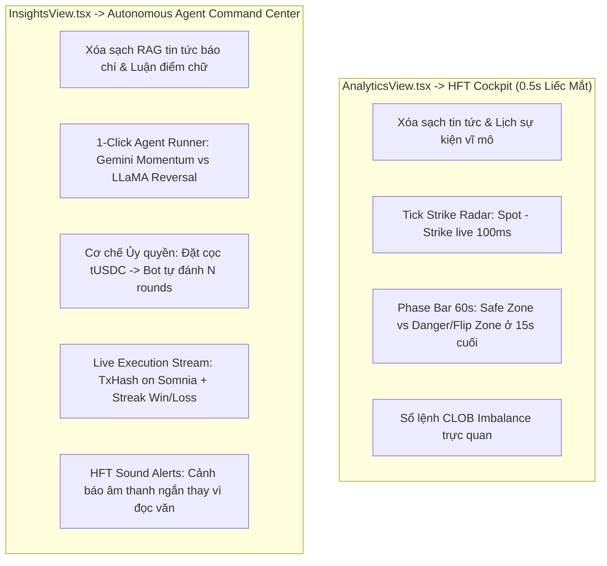

# 📋 BÁO CÁO PHÂN TÍCH ĐÁNH GIÁ & KẾ HOẠCH CẢI THIỆN FORESIGHT
> **Dự án:** ForeSight — Autonomous Binary Prediction Terminal on Somnia Shannon Testnet  
> **Nguồn đánh giá:** danhgia.txt, On-Chain Tx Audits & User Alignment  
> **Cập nhật ngày:** 10/09/2026 (Phiên bản đồng bộ hoàn tất)  
> **Mục tiêu:** Khắc phục triệt để các sai lệch về bản chất sản phẩm (Prediction Market vs Futures), loại bỏ 100% dữ liệu mock/fake, chuẩn hóa toàn bộ luồng dữ liệu từ DreamDEX (Strike, Pairs, Orderbook), tích hợp bộ định lượng vào AnalyticsView, chuẩn hóa luồng đặt lệnh theo chuẩn Polymarket và xác thực chính xác chu kỳ vòng đời vị thế On-Chain (Settlement & Refund).

---

## 1. TỔNG HỢP CÁC QUYẾT ĐỊNH THIẾT KẾ CỐT LÕI (ALIGNED ARCHITECTURE)

1. **Cơ chế vào/đóng lệnh (No Early Exit / No TP-SL):**
   - Không áp dụng TP/SL và không áp dụng Early Cash-out cho các vòng cược siêu ngắn (1m, 5m, 15m).
   - Đã loại bỏ hoàn toàn cột `Early exit` trong bảng Positions & Settlement Record.
   - Mô hình tinh gọn chuẩn xác: **BUY YES hoặc BUY NO -> Khóa cược -> Đếm ngược hết round -> Oracle chốt kết quả -> Claim thưởng**.
   - Xóa bỏ hoàn toàn các hàm `Math.random()` fake khớp lệnh trên frontend/backend.
2. **Đồ thị giá (Spot Price Candlesticks thay vì % ảo):**
   - Đồ thị chính chuyển sang hiển thị **Nến giá thực tế (Spot Price)** của BTC/ETH/SOL.
   - Vẽ đường kẻ ngang **Strike Price (mức giá mục tiêu)** lấy trực tiếp từ DreamDEX contract để người dùng thấy rõ nến đang dao động trên hay dưới vạch mục tiêu.
   - Các nút Timeframe (1m, 5m, 15m, 1h) kết nối dữ liệu thực.
3. **Gom toàn bộ thuật toán định lượng vào AnalyticsView.tsx:**
   - Gom các chỉ số toán học tài chính vào một trung tâm phân tích duy nhất:
     - **CLOB Orderbook Imbalance (OI):** Tỷ lệ áp lực mua/bán ở các bước giá tốt nhất.
     - **Spread Compression & Velocity:** Tốc độ co giãn biên độ Bid/Ask.
     - **Black-Scholes Binary Fair Value (Phi(d2)):** Xác suất toán học định giá hợp đồng nhị phân.
     - **Oracle Drift & Target Distance:** Khoảng cách giữa giá Spot hiện tại và điểm Strike.
4. **Chuẩn hóa 100% Data Flow từ DreamDEX:**
   - Nhận diện toàn bộ 58+ market thật trên DreamDEX Testnet (bao gồm các venue `0x1a1e68...`, `0x679795...`, `0xa3c034...`).
   - Parse chính xác `strikePrice` từ `rawInfo.strike` của DreamDEX (format chuẩn số thập phân USD).
   - Xóa bỏ toàn bộ market mock (`sol-hourly-clob-1`, `FALLBACK_MARKETS`).
   - Không fake orderbook ngẫu nhiên (`Math.abs(seed...)`) trong DepthChart.tsx.
   - Động hóa số lượng thị trường hiển thị (`{filteredMarkets.length} ACTIVE`).

---

## 2. NHẬT KÝ CẢI TIẾN & KHẮC PHỤC ON-CHAIN GẦN ĐÂY (EXECUTION & AUDIT UPDATES)

### 2.1. Redesign Order Ticket theo chuẩn UX Polymarket
- **Hiện trạng cũ:** Giao diện ScenarioSimulator rườm rà, nhiều thông số phức tạp, trải nghiệm khó tiếp cận.
- **Cải tiến:** Tái cấu trúc Order Ticket tinh gọn theo chuẩn Polymarket:
  - Chọn Tab `YES` / `NO` trực quan với màu sắc nhận diện rõ ràng.
  - Nhập số lượng USD đầu tư nhanh với các preset chip ($10, $25, $50, $100, Max).
  - Tự động tính toán tức thì: Số hợp đồng (Shares), Giá trung bình (Avg Price), Lợi nhuận tiềm năng (Potential Return) và Tỷ suất sinh lời (ROI %).
  - Xử lý 2 bước ký MetaMask EIP-20 Approve & Place Order mượt mà.

### 2.2. Kiểm toán lỗi Revert `TradingNotActive()`
- **Sự cố:** Ghi nhận giao dịch thất bại `0x999f033f...` với revert reason `TradingNotActive()`.
- **Nguyên nhân:** Người dùng gửi lệnh khi pool đã bước vào cutoff window trước thời điểm hết hạn (thường là 30s trước Expiry).
- **Khắc phục:** Thêm logic kiểm tra thời gian thực trên Order Ticket; tự động vô hiệu hóa nút đặt lệnh và cảnh báo `Trading cutoff reached` khi round sắp kết thúc.

### 2.3. Kiểm toán dòng tiền On-Chain & Cơ chế Hoàn vốn (Case Tx `0x58f7...8ef0`)
- **Hiện tượng:** Người dùng đặt lệnh mua YES 50 tUSDC, giao dịch thành công nhưng khi round hết hạn số dư ví không đổi và trước đó bị hiển thị nhầm là `EXPIRED LOSS` hoặc `WIN`.
- **Phát hiện On-chain:**
  - Lệnh gửi dưới dạng Limit Order sát giờ (`orderType: 0`), hợp đồng DreamDEX emit sự kiện `OrderPlaced` và `OrderRested` (không tìm thấy counterparty khớp lệnh trước khi hết round).
  - Tại thời điểm đáo hạn round, lệnh limit chưa khớp tự động bị hủy và **100% tiền ký quỹ (50.0005 tUSDC) đã được smart contract hoàn trả nguyên vẹn về ví** (không mint outcome token).
- **Sửa đổi kiến trúc:**
  - Bổ sung trạng thái chính thức `REFUNDED` vào toàn bộ hệ sinh thái (Server, Store, UI).
  - Khắc phục lỗi nhánh điều kiện trong `src/ui/App.tsx` (từng bỏ sót `REFUNDED`, khiến lệnh bị rơi vào nhánh `isWinner === false` và gán nhầm thành `SETTLED_LOSS` trong `localStorage`).
  - Cột Payout hiển thị minh bạch: `$50.00 USDC / 100% Refunded ($0 PnL)`.

### 2.4. Chuẩn hóa chu kỳ 7 trạng thái lệnh & UI 100% Tiếng Anh
- **Chu kỳ trạng thái toàn diện:**
  1. `RESTING`: Lệnh Limit nằm trên orderbook chờ đối ứng (collateral nằm trong pool escrow).
  2. `IN FLIGHT`: Lệnh đã khớp (OrderFilled), đang nắm giữ outcome shares chạy trong round.
  3. `RESOLVING`: Round đã hết giờ, đang chờ Keeper/Oracle chốt giá.
  4. `SETTLED WIN`: Dự đoán trúng, round đã finalized, claimable $1.00/contract.
  5. `EXPIRED LOSS`: Dự đoán trượt, payout $0.00 (-100%).
  6. `REFUNDED`: Lệnh limit không khớp trước khi hết giờ, 100% vốn hoàn về ví.
  7. `CLAIMED`: Đã nhận tiền thưởng payout về ví thành công.
  8. `CLOSED`: Đóng lệnh thủ công.
- **Chuẩn hóa giao diện:**
  - Loại bỏ hoàn toàn tooltips (`title`) và con trỏ `cursor-help` để giao diện mượt mà, không vướng mắt.
  - Loại bỏ toàn bộ phụ đề tiếng Việt (`Hoàn tiền`, `Chờ khớp`,...), chuyển toàn bộ ứng dụng sang **100% tiếng Anh chuẩn quốc tế**.

### 2.5. Nâng cấp MarketTicker kết nối Realtime DreamDEX CLOB & Spot Oracles
- **Hiện trạng cũ:** Thanh ticker marquee cuộn ngang tự động chỉ query fallback Binance hoặc format giá không phù hợp với binary markets.
- **Cải tiến:**
  - Endpoint `/api/tickers` kết nối trực tiếp `watcher.getActiveEventContracts()` từ DreamDEX indexer (`dev.smk.somnia.host`).
  - Hiển thị cả 2 luồng dữ liệu thời gian thực:
    1. **Hợp đồng dự đoán DreamDEX:** Hiển thị tên hợp đồng kèm mức giá mục tiêu (`BTC > $78,721.01`, `ETH > $2,491.74`), tỷ lệ cược YES (`YES $0.50 (50%)`) và biến động odds.
    2. **Spot Oracles:** Cập nhật liên tục giá Spot BTC, ETH, SOL, SOMI.
  - Tự động đồng bộ mỗi 3.5-4 giây.

### 2.6. Đồng bộ Panel POSITIONS & SETTLEMENT ở Footer Terminal (`ThesisHealthMonitor.tsx`)
- **Hiện trạng cũ:** Bảng điều khiển chân trang chỉ có 2 nhãn cứng nhắc (`In Flight` và `Settled`), không nhận diện các trạng thái nâng cao như `REFUNDED`, `EXPIRED LOSS`, `SETTLED WIN`, `RESTING`, `RESOLVING`.
- **Cải tiến:**
  - Nhúng toàn bộ bộ lọc động học 7 trạng thái lệnh chuẩn sàn giao dịch đồng bộ hoàn toàn với `ActivityView` và `PositionsTable`.
  - Drawer `Orders (N)` hiển thị chi tiết từng lệnh: Cột Payout / PnL minh bạch (`$50.00 (Refunded)` cho lệnh hoàn tiền; `-$50.00 (-100%)` cho cược thua; `+$ROI%` cho cược thắng).
  - Tích hợp nút `CLAIM (N)` trực tiếp ngay trên thanh Dock chân trang khi có vị thế thắng cần rút vốn về ví.

---

## 3. MA TRẬN PHÂN CÔNG & FILE THAY ĐỔI

| Thành phần | File đã cập nhật | Nội dung cải tiến & xử lý |
| :--- | :--- | :--- |
| **Market Data Watcher** | `src/core/market-watcher.ts` | • Hỗ trợ toàn bộ venue hợp lệ của DreamDEX. • Parse đúng strikePrice từ rawInfo.strike. • Trích xuất interval, expirationTime, marketAddress, token IDs. |
| **Backend API Server** | `src/server/index.ts` | • Xóa mock push. • Thêm động cơ `resolvePositionOnChain` truy vấn trực tiếp contract `0xbF4a49e0...`. • Bổ sung hỗ trợ `REFUNDED` trong `isPositionExpired`. |
| **Positions Store** | `data/positions.json` | • Lưu trữ lịch sử lệnh thực tế. • Đánh dấu chuẩn xác `REFUNDED` và `isRefunded: true` cho lệnh không khớp. |
| **Contract Configuration** | `src/ui/utils/contracts.ts` | • Cập nhật địa chỉ singleton `DREAMDEX_SETTLEMENT_ADDRESS` thành `0xbF4a49e0Dfd092e5FBE8E5761064C49533e6Ed23`. |
| **Positions Table** | `src/ui/components/PositionsTable.tsx` | • Bỏ cột Early exit. • Nâng cấp cột `Payout / PnL` (phân biệt Win, Loss, Refunded). • Cột Status chuẩn 100% tiếng Anh, không tooltips. |
| **Activity View** | `src/ui/components/ActivityView.tsx` | • Phân loại tab `ALL`, `IN FLIGHT`, `SETTLED` chuẩn xác (bao gồm `REFUNDED`). • Truyền dữ liệu `enrichedPositions` sang ActivityTable. |
| **Activity Table** | `src/ui/components/ActivityTable.tsx` | • Đồng bộ đầy đủ các badge `RESTING`, `IN FLIGHT`, `RESOLVING`, `WIN`, `LOSS`, `REFUNDED`, `CLAIMED`. |
| **App State & Cache** | `src/ui/App.tsx` | • Viết lại hàm `resolveStatus` ưu tiên `REFUNDED`. • Chữa lành dữ liệu cũ trong `localStorage`. |
| **Trading Form** | `src/ui/components/ScenarioSimulator.tsx` | • Tinh gọn hóa giao diện theo cảm hứng Polymarket. • Xóa bỏ TP/SL, tập trung vào BUY YES/NO và payout ước tính. |
| **Price Chart** | `src/ui/components/PriceChart.tsx` | • Nến giá Spot thật kèm đường Strike Price. |
| **Orderbook Depth** | `src/ui/components/DepthChart.tsx` | • Kết nối depth thật, loại bỏ seed/random. |
| **Trung tâm Định lượng** | `src/ui/components/AnalyticsView.tsx` | • Gom Orderbook Imbalance, Spread Velocity, Black-Scholes Fair Value vào một nơi. |

---

## 4. CHECKLIST KIỂM THỬ NGHIỆM THU (ACCEPTANCE CRITERIA)

- [x] Mọi cặp tiền hiển thị trên sidebar đều đến từ DreamDEX indexer (`dev.smk.somnia.host`).
- [x] Điểm Strike Price hiển thị chính xác theo USD (ví dụ: BTC $78,725.05, ETH $2,500.35).
- [x] Không còn bất kỳ mã nguồn nào dùng `Math.random()` để giả vờ tạo giao dịch hay fake orderbook.
- [x] Form đặt lệnh không còn TP/SL, trải nghiệm chuẩn Polymarket (Yes/No, Payout, ROI%).
- [x] Màn hình AnalyticsView hiển thị đầy đủ các chỉ số định lượng thời gian thực.
- [x] Bảng Positions & Settlement Record bỏ cột Early exit.
- [x] Khắc phục triệt để lỗi gán nhầm trạng thái lệnh hoàn vốn (`REFUNDED`) thành `EXPIRED LOSS`.
- [x] Cột Status hiển thị 100% tiếng Anh tinh gọn, không có tooltips gây vướng.
- [x] Cột Payout hiển thị minh bạch Payout và PnL theo từng trường hợp (Win / Loss / Refunded).
- [x] Build TypeScript và Vite (`npm run build`) vượt qua 100% với 0 lỗi.

---

## 5. ĐỊNH HƯỚNG CHIẾN LƯỢC ĐỘT PHÁ ĐỂ CHIẾN THẮNG HACKATHON (1-MINUTE AGENTIC TERMINAL)
> **Ngày phê duyệt định hướng:** 10/09/2026  
> **Trọng tâm:** Giải quyết triệt để nghịch lý "Prediction 1 phút không cần AI phân tích", né đòn đối thủ DreamPulse và tối đa hóa điểm số tiêu chí Somnia × DreamDEX.

### 5.1. Bóc tách Nghịch lý Cốt lõi (The 1-Minute Paradox)
* **Thực trạng phát hiện:** Trong các round prediction chốt nhanh (1 phút / 5 phút), người chơi hành động bằng **phản xạ (reflex), cảm quan dòng tiền (tape flow) và tốc độ**. Không một ai rảnh rỗi ngồi đọc văn bản phân tích hay nghe AI đọc bài luận dài dòng.
* **Sai lầm kiểu cũ:** Biến AI thành **"Nhà phân tích bằng lời (Analyst)"** — cố gắng đọc báo CoinDesk, viết luận Bull/Bear. Đây là tính năng thừa thãi và lệch pha hoàn toàn với sản phẩm.
* **Định vị mới:** Biến AI thành **"Tay đấm thực thi tự động (Autonomous Trading Agent)"**:
  * AI không sinh ra để giải thích lý lẽ cho người dùng đọc.
  * AI sinh ra để **làm thay con người**: Tự động quét sổ lệnh, tự động bắt nhịp chốt lệnh trong 300ms trên Somnia L1, giải phóng người dùng khỏi việc phải canh màn hình 60 round mỗi tiếng.

### 5.2. Bản đồ Cạnh tranh: ForeSight vs Đối thủ Cực mạnh (DreamPulse)
* **Phân tích đối thủ:** DreamPulse là dự án institutional-grade rất mạnh về mặt backend/quant (EIP-1167 smart account factory, 507 unit tests, no-code strategy builder, backtesting lab, khung giao dịch $\ge 15m$).
* **Chiến lược Bất đối xứng (Asymmetric Edge):** 
  * Không chạy đua làm no-code studio hay backtester phức tạp theo chân họ (tránh trùng lặp ý tưởng).
  * Chiếm trọn ngách **Consumer-Facing / 1-Minute High-Frequency Prediction** — phân khúc mà DreamPulse hoàn toàn bỏ trống:
    * DreamPulse phức tạp, hàn lâm $\to$ ForeSight tức thì, cảm xúc, thân thiện với retail degen.
    * DreamPulse chạy bot ngầm ẩn danh $\to$ ForeSight có **1-Click Agent Runner** trực quan, live PnL nhảy từng round.

### 5.3. Kế hoạch Tái Cấu Trúc 2 Màn Hình Cốt Lõi

#### A. Tái cấu trúc `AnalyticsView.tsx` $\to$ HFT Cockpit (Buồng Lái Phản Xạ 1 Phút)
1. **Xóa bỏ 100% văn bản rườm rà**: Gỡ bỏ `<EventTimeline />`, các phân tích vĩ mô, các đoạn mô tả Black-Scholes lý thuyết.
2. **Visual Strike Distance Radar**:
   * Thanh đo độ lệch $Spot - Strike$ cập nhật theo từng tick 100ms từ Binance Oracle.
   * Phân vùng màu trực quan: 🟢 *Safe Zone* ($> 0.05\%$) vs 🔴 *Danger / Flip Zone* ($\pm 0.01\%$).
3. **Round Expiry Phase Bar**: Hiển thị nhịp 60 giây:
   * `0s - 30s`: Open Accumulation.
   * `30s - 45s`: Momentum Lock.
   * `45s - 60s`: Pin-Risk / Last Seconds Squeeze.
4. **Mục tiêu**: Người dùng liếc mắt trong **0.5 giây** là nắm toàn bộ cục diện round cược mà không cần đọc chữ.

#### B. Tái cấu trúc `InsightsView.tsx` $\to$ Autonomous Agent Command Center
1. **Xóa bỏ 100% RAG News & Bài luận AI**: Gỡ bỏ bảng tin CoinDesk, gỡ bỏ các đoạn văn phân tích hỗ trợ/kháng cự của Gemini và LLaMA.
2. **Triển khai 1-Click Autonomous Agent Runner**:
   * Người dùng nạp hạn mức (ví dụ 10 tUSDC) và chọn 1 trong 2 Agent có sẵn:
     * ⚡ **Gemini Momentum Agent**: Đánh đu trend theo đà nến.
     * 🛡️ **LLaMA Reversal Agent**: Chuyên săn bẫy bẻ cầu khi thị trường bệt quá 4 cây cùng màu.
   * Bấm nút: **[ACTIVATE 10-ROUND AUTO RUN]** $\to$ Agent tự động gửi lệnh tương tác trực tiếp với hợp đồng DreamDEX trên Somnia L1 qua từng phút.
3. **Live Execution Feed & Streak Leaderboard**:
   * Bảng nhật ký khớp lệnh chạy theo thời gian thực (TxHash explorer link, PnL từng round).
   * Thống kê Win-Rate Streak (thắng liên tiếp bao nhiêu round).
4. **HFT Audio Alerts**: Chuyển giọng đọc dài 30 giây thành các hiệu ứng âm thanh cảnh báo phản xạ tức thì (*"10s Remaining"*, *"Strike Defended"*, *"Order Filled in 280ms"*).

---

## 6. KẾ HOẠCH HÀNH ĐỘNG TIẾP THEO (NEXT STEPS)
1. [ ] **Giai đoạn 1**: Tái cấu trúc [`AnalyticsView.tsx`](file:///D:/Coding/Somnia/src/ui/components/AnalyticsView.tsx) thành **1-Minute HFT Strike Radar** (xóa bỏ EventTimeline, lắp thanh đo Delta thời gian thực).
2. [ ] **Giai đoạn 2**: Tái cấu trúc [`InsightsView.tsx`](file:///D:/Coding/Somnia/src/ui/components/InsightsView.tsx) thành **Agent Command Center** (bỏ tin tức RAG, thêm giao diện ủy quyền Bot 1-Click Auto Run).
3. [ ] **Giai đoạn 3**: Hoàn thiện kịch bản Demo Video 2-3 phút kịch tính (showcase tốc độ sub-second của Somnia L1 và tính năng tự động cày vol của AI Agent).