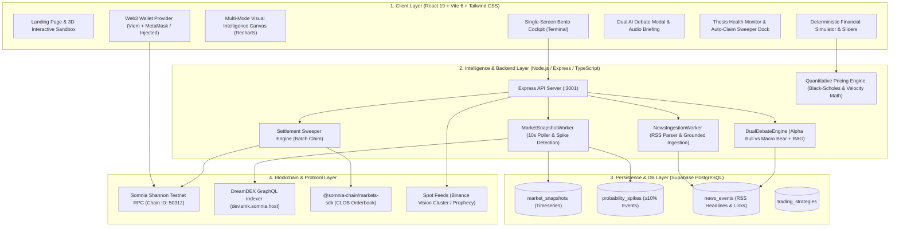
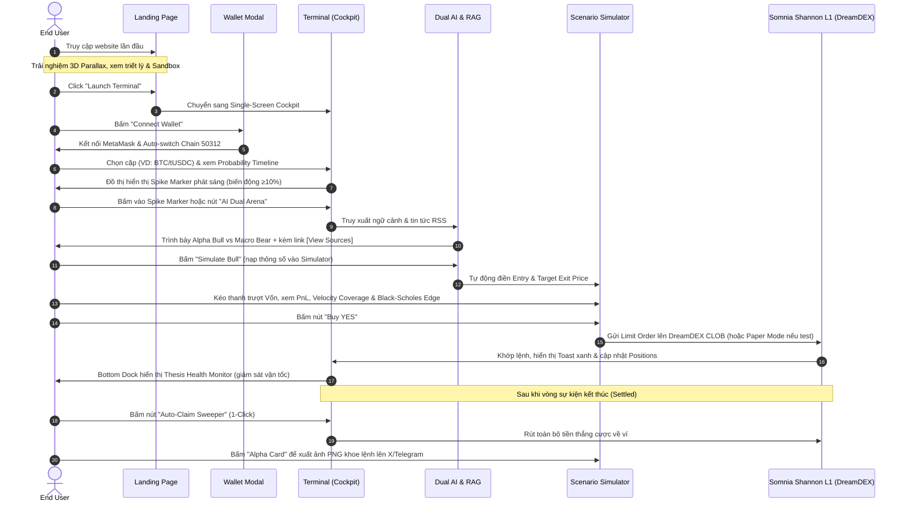

# 🧠 ForeSight — Project Details, Technical Architecture & Operational Guide
### *The Cognitive Trading Terminal for DreamDEX Event Contracts on Somnia L1*

> **Project Name:** ForeSight  
> **Core Philosophy:** *"Understand the market before you trade it"* (Hỗ trợ người dùng hiểu rõ bản chất thị trường trước khi tự ra quyết định)  
> **Tagline:** *Detect the move. Challenge the thesis. Model the trajectory. Execute with confidence.*  
> **Target Protocol:** DreamDEX Event Contracts via `@somnia-chain/markets-sdk`  
> **Blockchain Network:** Somnia Shannon Testnet (`Chain ID: 50312`)  
> **Live Demo:** [https://foresightdex.vercel.app/](https://foresightdex.vercel.app/)  
> **GitHub Repository:** [https://github.com/DanhCaTuanNgoc/ForeSight](https://github.com/DanhCaTuanNgoc/ForeSight)  

---

## 📌 1. Tuyên Bố Phạm Vi & Tính Khách Quan (Disclaimer & Scope)

> [!IMPORTANT]
> **Tuyên Bố Quan Trọng Về Mặt Sản Phẩm:**
> * **Không Phải Lời Khuyên Đầu Tư:** ForeSight là công cụ phân tích và hỗ trợ ra quyết định (Decision-Support Tool), **tuyệt đối không dự đoán tương lai thay cho người dùng** và **không cam kết bất kỳ mức lợi nhuận nào**.
> * **Kỷ Luật AI (Coincidence vs Causation):** Trợ lý AI trong ForeSight được thiết lập để chỉ nêu các sự kiện tin tức *diễn ra trùng thời điểm* với biến động giá, không tự ý khẳng định mối quan hệ nhân quả tuyệt đối.
> * **Minh Bạch Nguồn Tin (Evidence Grounding):** Mọi luận điểm AI tóm tắt đều đính kèm link bài báo gốc (`[View Sources]`) để người dùng tự click mở tab mới kiểm chứng, loại bỏ hoàn toàn rủi ro ảo giác (hallucination).
> * **Mô Phỏng Giả Định (Scenario Math):** Các chỉ số PnL/ROI trong Simulator là kết quả tính toán toán học thuần túy dựa trên các mốc giá do người dùng tự chọn, không phản ánh kết quả giao dịch thực tế nếu thị trường không đạt được mốc giá đó.

---

## 🌟 2. Bối Cảnh Thị Trường Binary Prediction Markets & Triết Lý ForeSight

### 2.1 Bối Cảnh Thực Tế Trên Somnia L1
Blockchain Somnia L1 được thiết kế với thông lượng cực cao (**>100K TPS**) và thời gian xác thực khối dưới 1 giây (**sub-second finality**). Trên nền tảng này, sàn giao dịch **DreamDEX** vận hành hơn **500 thị trường sự kiện nhị phân (Event Contracts)** theo các khung thời gian từ siêu ngắn (1 phút, 5 phút, 15 phút) đến trung hạn (1 giờ, 1 ngày).

Hợp đồng nhị phân (Binary Options / Event Contracts) có cơ chế:
* Giá mua mỗi cổ phần (share) dao động từ **$0.01 đến $0.99**.
* Khi đáo hạn (expiry/settlement): Nếu sự kiện đúng (YES thắng), mỗi share được thanh toán **$1.00**. Nếu sai (thua), giá trị về **$0.00**.

### 2.2 Ba Vấn Đề Nhức Nhối Của Người Tham Gia (Pain Points)
1. **Thiếu ngữ cảnh khi xác suất biến động mạnh (Flash Spikes $\ge 10\%$):** Khi tỷ lệ cược nhảy từ 30% lên 70% trong vài phút, người dùng thông thường khó nắm bắt kịp tin tức vĩ mô hoặc biến động giá spot của tài sản cơ sở.
2. **Áp lực thời gian & Ảo giác AI:** Các vòng ngắn đóng lệnh rất nhanh. Việc tự tìm kiếm tin tức thủ công là bất khả thi, trong khi các công cụ AI thông thường dễ bịa đặt lý do không có thật.
3. **Độ phức tạp khi tính toán lợi nhuận & Vốn bị bỏ quên (Stranded Capital):** 
   - Việc tính nhẩm điểm hòa vốn, lợi nhuận khi chốt lời sớm trước khi đáo hạn, hoặc tính toán xem vận tốc tăng giá hiện tại có kịp chạm mốc Strike hay không đòi hỏi công thức toán học cụ thể.
   - Khi tham gia nhiều vòng nhỏ, người dùng thường quên rút tiền thưởng (Claim) ở các vòng đã kết thúc.

### 2.3 Định Vị Chiến Lược: Tại Sao Là "Terminal" Thay Vì Thêm Một Sàn DEX?
* DreamDEX đã làm rất tốt vai trò hạ tầng sổ lệnh CLOB (Central Limit Order Book) và thanh khoản. Xây thêm một giao diện đặt cược đơn thuần không tạo ra giá trị mới.
* **ForeSight đóng vai trò là "Bloomberg Terminal" cho Event Contracts**: Tập trung giải quyết bài toán **nhận thức và hỗ trợ ra quyết định (Decision-Support)** trước khi người dùng thực hiện giao dịch, chuyển đổi từ cờ bạc may rủi sang giao dịch có phương pháp luận toán học rõ ràng.

---

## 🏗️ 3. Sơ Đồ Kiến Trúc Kỹ Thuật Toàn Diện (System Architecture)



---

## 🔄 4. Chu Trình Ra Quyết Định 4 Bước (4-Step Decision Workflow)

```text
┌─────────────────────────┐     ┌─────────────────────────┐     ┌─────────────────────────┐     ┌─────────────────────────┐
│       1. DETECT         │ ──> │       2. DEBATE         │ ──> │      3. SIMULATE        │ ──> │       4. EXECUTE        │
│   (What Happened?)      │     │    (What Changed?)      │     │      (What If?)         │     │    (What Do I Do?)      │
│   Probability Timeline  │     │   Dual AI Arena (RAG)   │     │   Trajectory Simulator  │     │   1-Click CLOB Trade    │
│  (Area Chart + Spikes)  │     │  (Bull vs Bear Debate)  │     │  (Deterministic Math)   │     │  & Auto-Claim Sweeper   │
└─────────────────────────┘     └─────────────────────────┘     └─────────────────────────┘     └─────────────────────────┘
```

* **Bước 1: DETECT — "What Happened?":** Trực quan hóa biến động xác suất ($0\% \rightarrow 100\%$) theo thời gian thực bằng Area Chart. Worker 10s tự động gắn thẻ **Spike Marker** phát sáng khi bước nhảy $\ge 10\%$.
* **Bước 2: DEBATE — "What Changed?":** Đối kháng 2 chiều giữa **Alpha Bull AI** và **Macro Bear AI**, tích hợp nguồn tin RSS minh bạch kèm link bài báo gốc và giọng đọc Radio Audio.
* **Bước 3: SIMULATE — "What If?":** Chuyển đổi cược nhị phân thành quỹ đạo kiểm chứng toán học: Vận tốc quỹ đạo ($VC$), mô hình Black-Scholes nhị phân $\Phi(d_2)$, và thanh trượt tính PnL/ROI với độ trễ 0ms.
* **Bước 4: EXECUTE — "What Do I Do?":** Đặt lệnh limit order trực tiếp lên DreamDEX CLOB qua `@somnia-chain/markets-sdk` (hoặc chế độ High-Fidelity Simulation) và gom tiền thắng cược bằng **Settlement Sweeper**.

---

## 🎛️ 5. Hướng Dẫn Chi Tiết 11 Cụm Tính Năng & Cách Thao Tác (Operational Guide)

### 5.1 Landing Page 3D Parallax & Interactive Sandbox
* **Chức năng:** Giới thiệu triết lý sản phẩm, thông số mạng Somnia L1 (>100k TPS, ~15ms fast-path), quy trình 4 bước và cung cấp bảng tương tác trực tiếp ngay tại trang chủ mà không cần đăng nhập ví.
* **Thao tác:**
  1. Cuộn trang để xem các hiệu ứng Cyberpunk neon và hạt phân tử nền (`CyberBackground`).
  2. Thử nghiệm thanh trượt giả lập mini trực tiếp trên Landing Page.
  3. Bấm **"Launch Terminal"** hoặc **"Enter Cockpit"** để truy cập ngay vào trạm giao dịch chính.

### 5.2 Sub-Second Market Ticker & Market Radar (Cột Trái)
* **Chức năng:** Quét và lọc hơn 500 thị trường nhị phân theo thời gian thực.
* **Thao tác:**
  1. Dải băng chuyền **Market Ticker** ở trên cùng chạy liên tục thông tin giá spot và tỷ lệ cược của BTC, ETH, SOL, SOMI.
  2. Tại cột bên trái (**Market Radar**): Gõ từ khóa vào ô tìm kiếm (ví dụ: "BTC", "ETH", "above") để lọc hợp đồng.
  3. Click vào bất kỳ cặp nào để chuyển toàn bộ bảng điều khiển trung tâm và phân tích sang thị trường đó.

### 5.3 Multi-Mode Visual Intelligence Canvas (Cột Giữa - Nửa Trên)
* **Chức năng:** Cung cấp 5 góc nhìn trực quan thay vì chỉ có biểu đồ nến thông thường.
* **5 Chế độ hiển thị:**
  1. **Probability Timeline (Mặc định):** Đồ thị vùng xác suất $0\% \rightarrow 100\%$, gắn thẻ **Spike Marker** khi biến động $\ge 10\%$. Hỗ trợ bật/tắt đường cong YES/NO hoặc chuyển sang biểu đồ nến (Candlestick).
  2. **Trajectory Cone (Monte Carlo):** Mô phỏng hình nón xác suất dự phóng theo độ biến động (Volatility: Low / Normal / High).
  3. **Orderbook Depth Chart:** Trực quan hóa độ sâu sổ lệnh Bid/Ask thực tế trên DreamDEX CLOB.
  4. **Correlation Heatmap:** Bản đồ nhiệt tương quan giữa các tài sản trên Somnia.
  5. **Event Timeline:** Mốc thời gian đối chiếu các tin tức vĩ mô xuất hiện song song với nến giá.
* **Tương tác đặc biệt (Interactive Price Targets):** Người dùng có thể kéo thả 2 đường nằm ngang `ENTRY` và `TARGET EXIT` trực tiếp trên đồ thị để tự động đồng bộ sang bộ tính toán Simulator.

### 5.4 Dual AI Agent Arena & Grounded News RAG (Cột Phải & Modal)
* **Chức năng:** Đập tan thiên vị tâm lý (anti-bias) và loại bỏ hoàn toàn ảo giác AI.
* **Cơ chế đối kháng:**
  * **Alpha Bull AI:** Luận điểm hỗ trợ chiều tăng (độ lệch sổ lệnh, khối lượng mua, tin tức tích cực).
  * **Macro Bear AI:** Luận điểm cảnh báo rủi ro (cản cung, rủi ro suy giảm giá trị theo thời gian time-decay, tin tức tiêu cực).
  * **Nút `[View Sources]`:** Mọi luận điểm đều trích xuất link bài báo thực tế (CoinDesk, Cointelegraph, Decrypt) để người dùng tự bấm vào kiểm chứng.
  * **🎙️ AI Audio Market Briefing:** Bấm nút radio phát giọng đọc tóm tắt thị trường bằng âm thanh tự nhiên kèm animation sóng âm.
* **Thao tác:** Bấm **"Simulate Bull"** hoặc **"Simulate Bear"** trong bảng điều khiển để tự động nạp chiến lược vào bộ giả lập.

### 5.5 Deterministic Decision Stress Test & Scenario Simulator (Cột Giữa - Nửa Dưới)
* **Chức năng:** Chuyển đổi hợp đồng cược nhị phân thành quỹ đạo quyết định kiểm chứng toán học với độ trễ **0ms** (chạy tại client, không phụ thuộc API LLM).
* **3 Tầng Toán Học Cốt Lõi:**
  1. **Toán học PnL & ROI Tất Định:**
     $$\text{Số Shares} = \frac{\text{Vốn (USDC)}}{\text{Giá Vào (Entry)}} \quad | \quad \text{PnL Chốt Sớm} = (\text{Số Shares} \times \text{Giá Mục Tiêu}) - \text{Vốn}$$
     $$\text{PnL Khi Thắng Đáo Hạn} = (\text{Số Shares} \times \$1.00) - \text{Vốn} \quad | \quad \text{Max Loss} = -100\% \text{ Vốn}$$
  2. **Vận Tốc Quỹ Đạo (Trajectory Feasibility & Velocity Coverage - $VC$):**
     * Vận tốc giá cần thiết: $v_{\text{req}} = \frac{|\text{Strike} - \text{Spot}|}{T_{\text{còn lại}}}$ (%/phút).
     * Đà tăng/giảm thực tế quan sát được: $v_{\text{obs}}$ (%/phút).
     * Tỷ số $VC = \frac{v_{\text{obs}}}{v_{\text{req}}}$: Nếu $VC \ge 1.0\times$ $\rightarrow$ Quỹ đạo khả thi; nếu $VC < 1.0\times$ $\rightarrow$ Cảnh báo đà tăng không đủ dốc để chạm mốc Strike trước khi hết giờ.
  3. **Mô Hình Định Lượng Black-Scholes Nhị Phân & Edge (bps):**
     * Tính toán giá trị hợp lý lý thuyết $\Phi(d_2)$ theo Black-Scholes.
     * So sánh với giá thị trường để tính **Lợi thế cạnh tranh (Edge bps)** và gợi ý tỷ trọng vốn theo công thức **Half-Kelly Criterion**.
* **Thao tác:** Kéo 3 thanh trượt: **Capital ($5–$500)**, **Entry Price ($0.05–$0.95)**, và **Target Exit Price ($0.05–$0.95)**. Kết quả PnL, ROI và điểm hòa vốn nhảy tức thì.

### 5.6 1-Click CLOB Order Execution & Chế Độ Kép (Live / Simulation)
* **Chức năng:** Thực thi lệnh trực tiếp mà không cần chuyển sang giao diện DreamDEX.
* **Cơ chế:**
  * **Live On-Chain Mode:** Khi ví kết nối Somnia Shannon Testnet, bấm `[Buy YES]` hoặc `[Buy NO]` sẽ gửi lệnh limit order lên DreamDEX CLOB qua `@somnia-chain/markets-sdk` và Viem.
  * **Simulation Sandbox Mode:** Nếu người dùng chưa kết nối ví hoặc chưa có tiền testnet, hệ thống tự động ghi nhận vị thế vào bộ nhớ mô phỏng (In-memory Ledger), giúp trải nghiệm mượt mà không gặp lỗi gián đoạn.

### 5.7 Settlement Sweeper — 1-Click Auto-Claim Thu Hồi Vốn
* **Chức năng:** Giải quyết triệt để tình trạng bỏ quên tiền thưởng ở các vòng cược ngắn đã kết thúc.
* **Thao tác:** Bấm nút **"Auto-Claim Sweeper"** trên Header hoặc thanh Dock dưới đáy màn hình. Hệ thống tự động quét toàn bộ các hợp đồng đã resolve, gom phần thưởng tất toán $1.00/share và gửi giao dịch rút tiền hàng loạt.

### 5.8 Live Thesis Health Monitor (Thanh Dock Dưới Đáy)
* **Chức năng:** Quản trị rủi ro sau khi đã vào lệnh (Post-Trade Monitoring).
* **Hiển thị:** Luôn ghim ở đáy màn hình:
  * Điểm sức khỏe vị thế (**Health Score %**).
  * Vận tốc thực tế so với vận tốc yêu cầu ($1.24\times \text{ Req}$).
  * Mốc giá vi phạm giả định (**Thesis Break Price**). Nếu giá spot vi phạm mốc này, hệ thống cảnh báo người dùng nên cân nhắc đóng vị thế sớm.

### 5.9 Ba Phân Hệ Mở Rộng: Analytics, AI Insights, Activity
* **Tab Analytics:** Thống kê tổng volume 24h trên CLOB, số cặp thị trường đang mở, đồ thị độ sâu toàn sàn và bản đồ nhiệt.
* **Tab AI Insights:** Bảng tin trực tiếp của AI Copilot, phát hiện các cơ hội giao dịch có tỷ lệ Risk/Reward tốt và cho phép bấm "Trade Signal" để tải thẳng vào Terminal.
* **Tab Activity:** Sổ cái minh bạch hiển thị danh sách lệnh đang mở (OPEN), lệnh đã kết thúc (SETTLED), tổng vốn đã đầu tư, số tiền đang chờ Claim và số dư ví.

### 5.10 HD Alpha Card Generator (Chia Sẻ Cộng Đồng)
* **Chức năng:** Tạo thẻ ảnh đồ họa độ phân giải cao 1200×675 (tỷ lệ chuẩn Twitter/X và Telegram) để người dùng chia sẻ phân tích của mình.
* **Thao tác:** Bấm nút **"Alpha Card"** trong Simulator $\rightarrow$ Modal hiển thị thẻ đồ họa Cyberpunk render bằng HTML5 Canvas $\rightarrow$ Bấm **"Copy Image"** hoặc **"Download PNG"** hoặc **"Share to X"**.

### 5.11 Web3 Wallet Engine (MetaMask / Somnia Shannon)
* **Chức năng:** Quản lý kết nối ví mượt mà, hỗ trợ mạng Somnia Shannon (Chain ID 50312).
* **Tính năng:**
  * 1-Click kết nối MetaMask hoặc bất kỳ ví EIP-1193 nào.
  * Tự động phát hiện sai mạng và cung cấp nút bấm **"Switch to Somnia Shannon"** tự động nạp cấu hình RPC vào ví.
  * Hiển thị số dư token testnet STT, tự động refresh.
  * Link dẫn thẳng đến Vòi nhận coin miễn phí (**Official Somnia Faucet**).

---

## 🔄 6. Luồng Hoạt Động Của End-User Từ A Đến Z (End-to-End User Journey)

Quy trình trải nghiệm người dùng được thiết kế chuẩn xác theo mô hình **What Happened? $\rightarrow$ What Changed? $\rightarrow$ What If? $\rightarrow$ What Do I Do?** với thời gian tiếp cận dưới 30 giây:



---

## 📊 7. Đánh Giá Trạng Thái Hoàn Thiện Dự Án

### 7.1 Ma Trận Tiến Độ Chi Tiết

| Thành Phần / Tính Năng | Mức Hoàn Thiện | Trạng Thái Thực Tế Trong Codebase | Ghi Chú Kỹ Thuật |
| :--- | :---: | :---: | :--- |
| **Giao diện Landing Page** | **100%** | Hoàn thành | 3D Parallax, Cyberpunk theme, Sandbox, Mobile Responsive |
| **Bento Box Terminal Cockpit** | **100%** | Hoàn thành | Thiết kế single-screen scroll-free, chia 3 cột khoa học |
| **Kết nối ví Web3 & Somnia Shannon** | **100%** | Hoàn thành | Hỗ trợ Viem, MetaMask, auto switch Chain 50312, Faucet link |
| **Đồ thị Visual Intelligence (5 modes)** | **100%** | Hoàn thành | Area, Candlestick, Monte Carlo, Depth, Heatmap, Timeline |
| **Tương tác kéo thả giá trên Chart** | **100%** | Hoàn thành | Kéo Entry/Exit line trực tiếp trên đồ thị đồng bộ vào Simulator |
| **Thu thập tin tức RSS & RAG** | **100%** | Hoàn thành | Worker cào tin CoinDesk/Cointelegraph/Decrypt lưu Supabase |
| **Dual AI Agent Arena (Bull vs Bear)** | **100%** | Hoàn thành | Có prompt phân vai, trích dẫn link gốc `[View Sources]`, AI Voice |
| **Toán học Simulator & Trajectory** | **100%** | Hoàn thành | Chạy 0ms client-side, $VC$ Velocity Coverage, Black-Scholes $\Phi(d_2)$ |
| **Đặt lệnh DreamDEX CLOB** | **100%** | Hoàn thành | Đã tích hợp SDK + Viem, có cơ chế Fallback Paper Trading |
| **Auto-Claim Settlement Sweeper** | **100%** | Hoàn thành | Quét batch claim các hợp đồng đáo hạn trên contract & memory |
| **Tạo thẻ chia sẻ Alpha Card HD** | **100%** | Hoàn thành | HTML5 Canvas 1200×675 xuất file PNG và copy clipboard |
| **Âm thanh tương tác & Voice Briefing** | **100%** | Hoàn thành | Sound FX click, chime thành công, Web Speech API radio voice |
| **Hệ thống Test tự động** | **100%** | Hoàn thành | 8 test suites, 64/64 unit tests đỗ 100% qua Vitest |
| **Sẵn sàng triển khai Cloud** | **100%** | Hoàn thành | Đã có `vercel.json`, `railway.json`, `Procfile`, build UI đỗ 100% |

### 7.2 Đánh Giá Mức Độ Hoàn Thiện
* **Về mặt sản phẩm Hackathon:** Dự án đã **hoàn thành 100% các tính năng đề ra theo Master Execution Plan**. Toàn bộ chu trình từ xem thông tin, phân tích AI, thử nghiệm toán học, đặt lệnh, quản lý vị thế, claim thưởng và chia sẻ mạng xã hội đều đã hoạt động trơn tru.
* **Về mặt độ tin cậy vận hành:**
  * Backend hỗ trợ cơ chế kép: Ký giao dịch trực tiếp on-chain lên CLOB qua private key / MetaMask, hoặc kích hoạt **High-Fidelity Simulation Sandbox** khi chạy môi trường demo không kết nối ví thật, đảm bảo không bao giờ gặp lỗi trắng màn hình.

---

## 🎨 8. Đánh Giá Trải Nghiệm Người Dùng (UX/UI Review)

### 8.1 Các Điểm Mạnh Vượt Trội (Highlights)
1. **Triết Lý "Zero-Scroll Single-Screen Cockpit":**
   - Toàn bộ các bảng điều khiển (Radar bên trái, Chart & Simulator ở giữa, AI Context bên phải, Thesis Monitor dưới đáy) nằm trọn trong 1 màn hình `100vh` chuẩn Bloomberg Terminal. Không cần cuộn trang liên tục để tìm nút đặt lệnh.
2. **Thiết Kế Cyberpunk Dark-Mode Sang Trọng:**
   - Tông màu nền Obsidian `#0A0A0F`, viền tím `#2A2A3D`, điểm nhấn neon xanh Emerald `#10B981` (cho YES/Bull) và đỏ Rose `#F43F5E` (cho NO/Bear). Font Monospace kỹ thuật số mang lại phong cách chuyên nghiệp cho Web3.
3. **Phản Hồi Xúc Giác & Thính Giác (Tactile & Audio Feedback):**
   - Tích hợp Sound FX cho từng cú click chuột, âm thanh chime khi khớp lệnh thành công hoặc claim tiền, và tính năng radio tóm tắt tin tức bằng giọng nói (`AI Voice Briefing`).
4. **Toán Học Tức Thì (Zero Network Latency):**
   - Kéo thanh trượt Simulator cho phản hồi 60fps mượt mà, tính toán hàng loạt chỉ số tài chính và vật lý đà giá mà không có độ trễ mạng.
5. **Cơ Chế Onboarding & Failsafe An Toàn:**
   - Thanh **Quickstart Quest** hướng dẫn người mới 4 bước. Nếu mạng Somnia bị chậm hoặc indexer nghẽn, UI tự động kích hoạt fallback data mượt mà.

### 8.2 Khuyến Nghị Tối Ưu Thêm (Future Polish)
1. **Code-splitting gói Bundle Frontend:** Dùng `dynamic import()` chia nhỏ bundle khi build để tối ưu thời gian tải trang lần đầu trên thiết bị di động.
2. **WebSocket Orderbook Streaming:** Nâng cấp cơ chế cập nhật sổ lệnh từ polling (6s) sang WebSocket trực tiếp để các bước nhảy nến hiển thị real-time từng mili-giây theo đúng tốc độ Somnia L1.
3. **Mở rộng nguồn RAG sang On-chain Data:** Bổ sung thêm dữ liệu luồng tiền ví cá mập (Whale movements) trên Somnia để AI phân tích toàn diện hơn ngoài nguồn tin báo chí RSS.

---

## 🚀 9. Hướng Dẫn Chạy Thử & Triển Khai Thực Tế

### Cách Chạy Local:
```bash
# 1. Cài đặt thư viện phụ thuộc
npm install

# 2. Chạy kiểm thử tự động toàn diện
npm run test

# 3. Khởi động backend API server & workers
npm run server

# 4. Khởi động giao diện người dùng Vite React
npm run ui
```

### Thông Số Mạng Somnia Shannon Testnet:
* **Network Name:** Somnia Shannon Testnet
* **Chain ID:** `50312`
* **Currency Symbol:** `STT`
* **RPC URL:** `https://api.infra.testnet.somnia.network`
* **Explorer:** `https://shannon-explorer.somnia.network`
* **Faucet:** `https://testnet.somnia.network/faucet`

---

*Tài liệu được chuẩn hóa phục vụ Somnia × DreamDEX Event Contracts Hackathon.*
