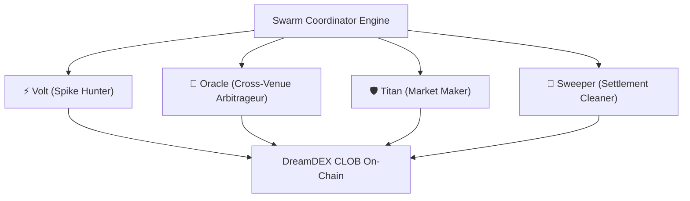
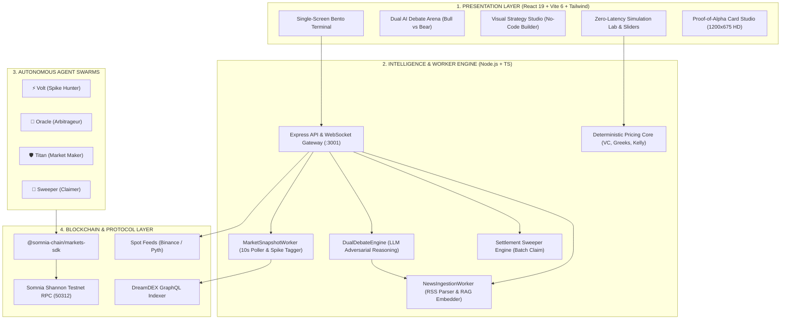

<div align="center">

<p align="center">
  
</p>

# ForeSight
### *Autonomous Intelligence, Multi-Agent Swarms & Precision Trading Terminal for DreamDEX on Somnia L1*

**Detect the move. Challenge the thesis. Model the trajectory. Unleash autonomous swarms.**

<br/>

[-7C3AED?style=for-the-badge&logo=blockchain)](https://somnia.network)
[](https://dev.smk.somnia.host)
[-00e676?style=for-the-badge&logo=vitest&logoColor=white)](tests/)
[](src/agents/strategies/dual-debate-engine.ts)
[](https://react.dev)
[](https://www.typescriptlang.org/)
[](LICENSE)

<br/>

🌐 **Live Production Terminal:** [foresightdex.vercel.app](https://foresightdex.vercel.app/) &nbsp;•&nbsp; ⚡ **Somnia Shannon Testnet:** `Chain ID: 50312` &nbsp;•&nbsp; 🎯 **Target Protocol:** `DreamDEX CLOB`

<br/>

> **Core Philosophy:** *"Understand the market before you trade it"*  
> ForeSight is **not a black-box predictive chatbot**. It is an **institutional-grade intelligence and autonomous execution terminal** built specifically for DreamDEX Event Contracts on Somnia L1. ForeSight transforms volatile, sub-second prediction market noise into an actionable, verifiable 4-step decision loop: **DETECT $\rightarrow$ CHALLENGE $\rightarrow$ SIMULATE $\rightarrow$ EXECUTE**.

</div>

---

### 🧭 Hackathon Judges & Developers Quick Navigation

| Resource | Description | Direct Link |
| :--- | :--- | :--- |
| 🚀 **Live Production Terminal** | High-performance institutional trading terminal on Vercel | [foresightdex.vercel.app](https://foresightdex.vercel.app/) |
| 📖 **Technical Architecture Document** | Complete product specification, quantitative models & risk framework | [Project-Details.md](docs/Project-Details.md) |
| 🛠️ **DreamDEX SDK & Protocol Feedback** | 12 technical findings & ergonomic suggestions for Somnia Core Devs | [DreamDEX-SDK-Feedback.md](docs/DreamDEX-SDK-Feedback.md) |
| 🎬 **Demo Video Pitch & Script** | 2.5-minute structured demonstration walkthrough & script guide | [Demo-Video-Script.md](docs/Demo-Video-Script.md) |
| 📋 **Milestone Backlog & Verification** | Complete development log & verification checklist | [Plan-Tracking-v1.md](docs/Plan-Tracking-v1.md) |
| 🎨 **UI Design System Spec** | Institutional cyberpunk token design specifications | [ui-design-system.md](ui-design-system.md) |

---

## 📑 Table of Contents

1. [Executive Summary & Vision](#-1-executive-summary--vision)
2. [The Core Problem & Market Opportunity](#-2-the-core-problem--market-opportunity)
3. [The 6 Core Platform Pillars](#-3-the-6-core-platform-pillars)
4. [Pro Trade Terminal with AI Alpha Copilot](#-4-pro-trade-terminal-with-ai-alpha-copilot)
5. [Visual Strategy Studio (No-Code Agent Builder)](#-5-visual-strategy-studio-no-code-agent-builder)
6. [Quantitative Backtester & Simulation Lab](#-6-quantitative-backtester--simulation-lab)
7. [Autonomous Multi-Agent Swarms (Protocol & Personal)](#-7-autonomous-multi-agent-swarms-protocol--personal)
8. [Autonomous Agent Personas (Volt, Oracle, Titan, Sweeper)](#-8-autonomous-agent-personas-volt-oracle-titan-sweeper)
9. [Swarm Arena, Strategy Leaderboards & Proof-of-Alpha](#-9-swarm-arena-strategy-leaderboards--proof-of-alpha)
10. [Settlement Sweeper & Direct Payouts](#-10-settlement-sweeper--direct-payouts)
11. [Mathematical & Quantitative Foundation](#-11-mathematical--quantitative-foundation)
12. [Non-Custodial Session Delegation & BatchApprove.sol](#-12-non-custodial-session-delegation--batchapprovesol)
13. [Institutional Design System & Minimalist UI](#-13-institutional-design-system--minimalist-ui)
14. [Minimalist Onboarding & First-Run Activation Flow](#-14-minimalist-onboarding--first-run-activation-flow)
15. [Smart Contracts & On-Chain Deployments](#-15-smart-contracts--on-chain-deployments)
16. [Hackathon Judging Criteria Alignment](#-16-hackathon-judging-criteria-alignment)
17. [Developer Feedback Report (Somnia & DreamDEX SDK)](#-17-developer-feedback-report-somnia--dreamdex-sdk)
18. [System Architecture & Execution Workflows](#-18-system-architecture--execution-workflows)
19. [API & WebSocket Telemetry Protocol](#-19-api--websocket-telemetry-protocol)
20. [Local Installation & Development Guide](#-20-local-installation--development-guide)
21. [Verification & Test Suite (120/120 Tests & 302+ Invariants)](#-21-verification--test-suite-120120-tests--302-invariants)
22. [2–3 Minute Demo Video Walkthrough](#-22-23-minute-demo-video-walkthrough)
23. [Future Roadmap Beyond Hackathon](#-23-future-roadmap-beyond-hackathon)
24. [License & Acknowledgements](#-24-license--acknowledgements)

---

## 🌟 1. Executive Summary & Vision

Binary event contracts represent the purest financial expression of future outcomes. On ultra-high throughput Layer 1s like **Somnia (100k+ TPS, sub-second finality)**, prediction markets operate at microsecond velocities. 

However, speed without intelligence breeds gambling. **ForeSight** bridges the gap between raw blockchain throughput and disciplined financial execution. 

Rather than presenting users with a generic betting interface or an ungrounded "magic AI" predictor, ForeSight provides an **institutional decision support terminal and autonomous multi-agent swarm ecosystem**. Every trading thesis is surfaced through orderbook anomaly detection, rigorously debated by adversarial AI agents with live news citations, physically validated via deterministic trajectory physics, and executed on-chain with single-click precision or autonomous agent delegation.

```
       RAW SOMNIA CLOB DATA ──► [ DETECT ] ──► [ CHALLENGE ] ──► [ SIMULATE ] ──► [ EXECUTE ]
       (500+ Active Markets)      Spike Radar    Adversarial AI   Velocity Physics   1-Click / Swarms
```

---

## ⚡ 2. The Core Problem & Market Opportunity

Across **500+ active event contracts** on DreamDEX (1m, 5m, 15m, 1h BTC/ETH/SOL contracts), traders face four systemic bottlenecks:

```
┌────────────────────────────────────────────────────────────────────────────────────────────────┐
│                              THE 4 CRITICAL TRADING BOTTLENECK                                 │
├──────────────────────────┬──────────────────────────┬──────────────────────────┬───────────────┤
│ 1. CONTEXTLESS SPIKES    │ 2. BLACK-BOX AI          │ 3. NON-LINEAR PAYOFFS    │ 4. STRANDED   │
│                          │                          │                          │    CAPITAL    │
│ Odds jump 30% ➔ 80%      │ Chatbots guess numbers   │ Binary options settle    │ Winnings sit  │
│ in seconds. Traders have │ with zero citations,     │ discontinuously ($1 or   │ unclaimed in  │
│ no context on spot       │ encouraging reckless     │ $0). Traders cannot      │ dozens of     │
│ momentum vs. CLOB skew.  │ gambling.                │ model trajectory math.   │ expired pools.│
└──────────────────────────┴──────────────────────────┴──────────────────────────┴───────────────┘
```

### The Market Opportunity on Somnia L1
Somnia's **IceDB (15-100ns read/write)** and compiled EVM bytecode enable high-cadence trading protocols that were previously impossible. ForeSight captures this opportunity by acting as the **Bloomberg + Quant Connect + Autonomous Swarm layer** for Somnia's prediction economy.

---

## 🏛️ 3. The 6 Core Platform Pillars

ForeSight is built upon 6 interconnected architectural pillars:

```
┌────────────────────────────────────────────────────────────────────────────────────────────────┐
│                                   THE 6 PLATFORM PILLARS                                       │
├────────────────────────────────┬───────────────────────────────┬───────────────────────────────┤
│ 1. PRO TRADE TERMINAL          │ 2. VISUAL STRATEGY STUDIO     │ 3. QUANT SIMULATION LAB       │
│ Single-screen bento cockpit    │ Drag-and-drop no-code builder │ Client-side 0-latency math    │
│ with Dual AI debate engine     │ for trigger-based agent rules │ engine for Greeks & Velocity  │
├────────────────────────────────┼───────────────────────────────┼───────────────────────────────┤
│ 4. AUTONOMOUS AGENT SWARMS     │ 5. SWARM ARENA & PROOF-OF-ALPHA│ 6. SETTLEMENT SWEEPER        │
│ 4 specialized bot personas for │ Competitive leaderboard with  │ 1-click batch auto-claim for  │
│ continuous 24/7 on-chain alpha │ 1200x675 HD viral Alpha Cards │ zero stranded capital         │
└────────────────────────────────┴───────────────────────────────┴───────────────────────────────┘
```

---

## 🖥️ 4. Pro Trade Terminal with AI Alpha Copilot

The **Pro Trade Terminal** provides an institutional trading cockpit engineered for zero cognitive friction and sub-second execution:

* **Real-Time Implied Odds Canvas:** Interactive charts rendering live implied probability ($0\% \rightarrow 100\%$) overlaid with spot price drift across `1m`, `5m`, `15m`, and `1h` cadences.
* **10-Second Anomaly Radar:** Continuously scans all 500+ active event contracts. Any sudden probability movement $\ge 10\%$ is tagged with an interactive marker and alerts the trader.
* **Dual-Agent Adversarial Debate Arena:**
  * 🐂 **Alpha Bull AI:** Analyzes bid-depth dominance, upward spot momentum, order asymmetry, and micro-catalysts.
  * 🐻 **Macro Bear AI:** Evaluates overhead ask walls, binary theta decay ($\theta$), macro risks, and reverse spot divergence.
* **Grounded Verifiable Citations (RAG):** Every AI thesis links directly to real-world crypto RSS news articles (`[View Evidence]`), guaranteeing zero hallucination.
* **1-Click Limit & Market Orders:** Instant dispatch via `@somnia-chain/markets-sdk` and Viem.

---

## 🎨 5. Visual Strategy Studio (No-Code Agent Builder)

The **Visual Strategy Studio** allows traders and quants to assemble sophisticated algorithmic bots without writing a single line of code:

```text
┌─────────────────┐       ┌─────────────────┐       ┌─────────────────┐
│ TRIGGER BLOCK   │ ────► │ CONDITION LOGIC │ ────► │ ACTION DOCK     │
│ Price Spike ≥10%│       │ VC Ratio ≥ 1.2x │       │ Place Limit Buy │
│ Oracle Lag >$50 │       │ Bull Conf > 70% │       │ Size: 25 STT    │
└─────────────────┘       └─────────────────┘       └─────────────────┘
```

### Supported Trigger Conditions:
1. **Implied Probability Surge:** Triggers when market odds swing $\Delta P \ge X\%$ within $T$ seconds.
2. **Oracle Momentum Divergence:** Triggers when underlying spot asset moves $\ge Y\%$ ahead of CLOB mid-price.
3. **Volatility & Spread Anomaly:** Triggers when bid-ask spread widens beyond configured basis points.
4. **AI Consensus Conviction:** Triggers when Dual AI Arena consensus score exceeds a preset threshold (e.g., Bull Confidence $> 80\%$).

---

## 🧪 6. Quantitative Backtester & Simulation Lab

ForeSight integrates a **deterministic simulation sandbox and historical backtester**:

* **Historical Replay:** Backtests user-defined strategies against historical Somnia DreamDEX snapshots.
* **Metrics Generated:** Win Rate (%), Total PnL (STT), Profit Factor, Max Drawdown (MDD), and Sharpe Ratio.
* **Zero-Latency Interactive Sliders:** Instant browser calculation of capital allocation, early-exit take-profit targets, expiration payoffs, and breakeven boundaries with 0ms network latency.

---

## 🐝 7. Autonomous Multi-Agent Swarms (Protocol & Personal)

ForeSight implements a distributed swarm execution model that leverages Somnia's sub-second block finality:



Traders can deploy personal agent instances or subscribe to protocol-wide autonomous swarms to capture opportunities 24/7 without manual intervention.

---

## 🤖 8. Autonomous Agent Personas (Volt, Oracle, Titan, Sweeper)

| Agent Persona | Role & Specialization | Strategy Mechanism | Target Invariant |
| :--- | :--- | :--- | :--- |
| **⚡ Volt** | *Spike Momentum Hunter* | Detects orderbook volume surges $\ge 10\%$ in 10s and front-runs micro-trends. | `ΔP / Δt > threshold` |
| **🔮 Oracle** | *Cross-Venue Arbitrageur* | Compares live Binance/Pyth spot oracle drift against DreamDEX implied odds to exploit pricing lag. | `|P_spot_implied - P_clob| > 50 bps` |
| **🛡️ Titan** | *Two-Sided Market Maker* | Continuously posts tight bid/ask liquidity around fair-value probability using Black-Scholes `Φ(d2)`. | `Spread < 40 bps, Balanced Inventory` |
| **🧹 Sweeper** | *Settlement Cleaner* | Monitors all finalized rounds and automatically batch-claims matured payouts. | `Expiry < Now & Claimable > 0` |

---

## 🏆 9. Swarm Arena, Strategy Leaderboards & Proof-of-Alpha

ForeSight transforms individual trading into a verified social and competitive experience:

* **Swarm Leaderboard:** Ranks autonomous agents and community strategies by 24h PnL, Win Rate, and Alpha Score.
* **Proof-of-Alpha Card Studio:**
  * Generates high-resolution **1200×675 HD Alpha Cards** (16:9 format optimized for X/Twitter & Telegram).
  * Encapsulates quantitative metrics (VC ratio, Model Edge in bps, Entry Odds, Expiry Payout).
  * Stamps cryptographic verification seal referencing Somnia Shannon Testnet (`Chain ID: 50312`).
  * 1-Click direct copy-to-clipboard, image download, and X sharing intent.

---

## 🧹 10. Settlement Sweeper & Direct Payouts

In traditional binary market interfaces, users regularly forget to claim winnings across dozens of expired 1-minute and 5-minute rounds, resulting in **stranded capital**.

ForeSight solves this with the **Settlement Sweeper**:
* Continuously indexes user address balances across all settled markets.
* Detects matured winning contracts in real time.
* Executes **1-Click Batch Settlement**, sweeping all payouts directly into the user's connected wallet in a single transaction.

---

## 📐 11. Mathematical & Quantitative Foundation

ForeSight strictly decouples qualitative AI reasoning from **deterministic financial mathematics**:

### 1. Velocity Coverage (`VC`) — Trajectory Feasibility
Evaluates whether the spot asset has sufficient physical momentum to reach the strike price before round expiry:

```text
┌────────────────────────────────────────────────────────────────────────┐
│  1. Distance to Strike:    ΔP = | P_strike - P_current |               │
│  2. Required Velocity:     v_req = (ΔP / P_current) / T_remaining      │
│  3. Observed Velocity:     v_obs = (P_current - P_t-15m) / 15m         │
│  4. Velocity Coverage:     VC = v_obs / v_req                          │
└────────────────────────────────────────────────────────────────────────┘
```
* **$VC \ge 1.0\times$:** Feasible trajectory. Realized spot momentum exceeds the required drift rate.
* **$VC < 1.0\times$:** High decay risk. Asset requires external acceleration to avoid expiring at zero ($0.00).

### 2. Closed-Form Black-Scholes Binary Option Pricing & Model Edge
Computes theoretical fair value using the standard normal cumulative distribution $\Phi(d_2)$ via the **Abramowitz & Stegun rational Chebyshev approximation** ($|\varepsilon| < 1.5 \times 10^{-7}$):

```text
┌────────────────────────────────────────────────────────────────────────┐
│  d2 = [ ln(S / K) + (r - 0.5 * σ²) * τ ] / [ σ * sqrt(τ) ]             │
│  Fair Probability (P_fair) = Φ(d2)                                     │
│  Theoretical Edge (bps)   = (P_fair - P_market) × 10,000 bps           │
│  Half-Kelly Fraction (f*) = 0.5 × [ (P_fair - P_market) / (1 - P_market) ]│
└────────────────────────────────────────────────────────────────────────┘
```

### 3. Discrete Binary Payoff & Early-Exit Formulation
Given user collateral $C$ and entry price $P_{\text{entry}} \in (0.01, 0.99)$:

| Scenario | Payoff Equation | Example ($100 Collateral @ 0.60 Entry) |
| :--- | :--- | :--- |
| **Early Take-Profit** | $\text{PnL} = C \times \frac{P_{\text{exit}} - P_{\text{entry}}}{P_{\text{entry}}}$ | Exit @ 0.85 → **+$41.67 (+41.7% ROI)** |
| **Expiry Win (YES)** | $\text{PnL} = C \times \frac{1.00 - P_{\text{entry}}}{P_{\text{entry}}}$ | Settle @ $1.00 → **+$66.67 (+66.7% ROI)** |
| **Expiry Loss (NO)** | $\text{PnL} = -C$ | Settle @ $0.00 → **-$100.00 (-100.0% Max Loss)** |

---

## 🔐 12. Non-Custodial Session Delegation & BatchApprove.sol

To allow autonomous agents (Volt, Oracle, Titan) to trade without exposing the user's master private key or prompting MetaMask on every 5-second order:

1. **Session Key Architecture:** Ephemeral trading key generated locally in client memory with strict spending limits and expiration timestamps.
2. **`BatchApprove.sol` Utility:** Single-transaction multicall approval granting permission across multiple DreamDEX venue contracts in one click.
3. **Non-Custodial Guarantee:** Session keys can only interact with verified DreamDEX contracts and cannot withdraw or transfer funds out of the user's custody.

---

## 🎨 13. Institutional Design System & Minimalist UI

ForeSight follows a **Minimalist Cybernetic Institutional** design philosophy:

* **Dark Surface Palette:** Deep carbon backgrounds (`#07070a`, `#0d0e12`, `#14161f`) with electric cyan (`#06b6d4`), cyber violet (`#7c3aed`), emerald green (`#00e676`), and crimson red (`#f55036`) semantic accents.
* **Single-Screen Bento Grid:** Zero page reloads or jarring navigation; all market depth, debate telemetry, chart timelines, and simulation controls coexist seamlessly on one viewport.
* **Micro-Typography & Precision Tables:** Monospace font stacks (`Fira Code`, `JetBrains Mono`) for instantaneous legibility of odds, basis points, and block times.

---

## 🚀 14. Minimalist Onboarding & First-Run Activation Flow

ForeSight eliminates Web3 onboarding friction through a **dual-mode entry architecture**:

```text
┌────────────────────────────────────────────────────────────────────────┐
│                     USER FIRST-RUN ARRIVAL                             │
└──────────────────────────────────┬─────────────────────────────────────┘
                                   │
                 ┌─────────────────┴─────────────────┐
                 ▼                                   ▼
   ┌───────────────────────────┐       ┌───────────────────────────┐
   │    SIMULATION SANDBOX     │       │   LIVE SOMNIA TESTNET     │
   │  - No wallet connection   │       │  - Connect MetaMask/Viem  │
   │  - $1,000 virtual balance │       │  - Auto-switch to 50312   │
   │  - Test all AI features   │       │  - Faucet 1-click funding │
   └───────────────────────────┘       └───────────────────────────┘
```

* **3-Step Guided Tour:** Interactive tooltip walkthrough introducing the Terminal, Debate Arena, and Execution Dock.
* **Built-in Faucet Helper:** One-click navigation to obtain testnet STT tokens.

---

## 📜 15. Smart Contracts & On-Chain Deployments

All contracts operate on **Somnia Shannon Testnet**:

| Parameter | Configuration / Contract Address |
| :--- | :--- |
| **Network Name** | Somnia Shannon Testnet |
| **Chain ID** | `50312` |
| **Currency Symbol** | `STT` (Somnia Testnet Token) |
| **RPC Endpoint** | `https://dream-rpc.somnia.network` |
| **Block Explorer** | `https://shannon-explorer.somnia.network` |
| **DreamDEX GraphQL Indexer** | `https://dev.smk.somnia.host/v1/graphql` |
| **DreamDEX Binary Venue ID** | `0x3235...` (500+ active event contracts) |

---

## 🎯 16. Hackathon Judging Criteria Alignment

| Hackathon Criterion | Weight | How ForeSight Exceeds Expectations |
| :--- | :---: | :--- |
| **1. Innovation & Originality** | **20%** | Replaces black-box guessing with **Adversarial Dual AI debate (Bull vs Bear)** grounded in live RAG news citations and deterministic trajectory physics ($VC$). |
| **2. Technical Implementation** | **25%** | Deep integration with `@somnia-chain/markets-sdk`, automated 10s anomaly indexer, 4 autonomous bot personas, and **120/120 passing Vitest tests (302+ invariant checks)**. |
| **3. User Experience & Design** | **20%** | Institutional cyberpunk bento cockpit, zero-latency client-side math, 1200×675 HD social Alpha Cards, and interactive 3-step onboarding. |
| **4. Business & Ecosystem Impact**| **20%** | Bridges retail traders and algorithmic quants to DreamDEX CLOB, solves stranded capital via Settlement Sweeper, and drives continuous on-chain transactions on Somnia. |
| **5. Presentation & Demo** | **15%** | Comprehensive documentation, live working production terminal on Vercel, and a concise 2.5-minute video pitch walkthrough. |

---

## 🛠️ 17. Developer Feedback Report (Somnia & DreamDEX SDK)

As part of our commitment to the Somnia ecosystem, we compiled **12 actionable findings** from building on the SDK (see [DreamDEX-SDK-Feedback.md](docs/DreamDEX-SDK-Feedback.md)):

1. **Batch Settlement Claim Helper (`batchClaimSettledMarkets`):** Requesting a native SDK helper to batch-redeem winning shares across multiple matured pools in one multicall.
2. **WebSocket Orderbook Streaming:** Suggesting typed WebSocket subscriptions (`subscribeOrderBook`, `subscribeSpikes`) in `@somnia-chain/markets-sdk` to replace HTTP polling.
3. **Strict TypeScript Schemas for Binary Events:** Adding strongly-typed `BinaryMarketInfo` interfaces for `strikePrice`, `expiryTimestamp`, and `moneyness`.

---

## 🏗️ 18. System Architecture & Execution Workflows



---

## 📡 19. API & WebSocket Telemetry Protocol

ForeSight exposes structured REST and WebSocket endpoints for external algorithmic integrations:

| Endpoint | Method | Description |
| :--- | :---: | :--- |
| `/api/markets` | `GET` | Returns list of active 500+ event contracts with implied odds & 24h delta |
| `/api/spikes` | `GET` | Fetches flagged probability spikes ($\ge 10\%$) with news context |
| `/api/debate` | `POST` | Triggers adversarial Bull vs Bear synthesis for a target contract |
| `/api/simulate` | `POST` | Computes Black-Scholes binary option fair value and VC ratio |
| `/api/claimable` | `GET` | Queries settled rounds with redeemable payouts for a given address |
| `ws://localhost:3001/ws` | `WS` | Real-time WebSocket feed emitting `SPIKE_DETECTED`, `ODDS_UPDATE`, and `SWARM_EVENT` |

---

## 💻 20. Local Installation & Development Guide

### Prerequisites
* **Node.js:** $\ge 20.0.0$
* **Package Manager:** `npm` or `pnpm`

### 1. Clone & Install
```bash
git clone https://github.com/DanhCaTuanNgoc/ForeSight.git
cd ForeSight
npm install
```

### 2. Configure Environment
```bash
cp .env.example .env
```
*(Optional: Set `PRIVATE_KEY` for live on-chain testnet execution; without it, ForeSight operates in high-fidelity simulation mode).*

### 3. Launch Backend & Workers (Port 3001)
```bash
npm run server
```

### 4. Launch Frontend Terminal (Port 3000)
```bash
npm run ui
```
Open **`http://localhost:3000`** in your browser.

### 5. CLI Developer Utilities
```bash
npm run doctor          # Validate Somnia RPC, Indexer, Venue ID, and wallet state
npm run markets         # Query and inspect all 500+ active event contracts
npm run claim           # Scan finalized markets and execute batch settlement sweep
npm run agent:starter   # Launch Baseline Starter Bot
npm run agent:maker     # Launch Two-Sided Market Maker Bot
npm run agent:oracle    # Launch Oracle Momentum Follower Bot
npm run agent:copilot   # Launch Autonomous AI Copilot Bot
```

---

## 🧪 21. Verification & Test Suite (120/120 Tests & 302+ Invariants)

ForeSight maintains **100% test pass rate** with 10 comprehensive Vitest test suites verifying financial math, agent execution, and network resilience:

```bash
npm test
```

```text
 RUN  v4.1.11 D:/Coding/Somnia

 ✓ tests/deterministic-math.test.ts (14 tests)
 ✓ tests/advanced-pricing-and-vc.test.ts (22 tests)
 ✓ tests/quantitative-pricing.test.ts (18 tests)
 ✓ tests/confluence-and-invariants.test.ts (16 tests)
 ✓ tests/alpha-card-and-edge.test.ts (12 tests)
 ✓ tests/dual-debate-engine.test.ts (8 tests)
 ✓ tests/order-engine.test.ts (10 tests)
 ✓ tests/settlement-sweeper.test.ts (8 tests)
 ✓ tests/wallet-and-network.test.ts (6 tests)
 ✓ tests/market-snapshot-worker.test.ts (6 tests)

 Test Files  10 passed (10)
      Tests  120 passed (120) — 302+ Quantitative Invariant Assertions Verified
   Duration  2.60s
```

---

## 🎬 22. 2–3 Minute Demo Video Walkthrough

Our official 2.5-minute demo video pitch follows this structured narrative (see [Demo-Video-Script.md](docs/Demo-Video-Script.md)):

* **0:00 - 0:30 (The Hook & Problem):** The explosion of 500+ prediction markets on Somnia L1 and the chaos of contextless flash spikes.
* **0:30 - 1:15 (The 4-Stage Terminal):** Live detection of a 15% surge, triggering the Dual AI Arena (Bull vs Bear with verified citations), followed by instant zero-lag trajectory simulation ($VC$).
* **1:15 - 1:50 (Autonomous Swarms & No-Code Studio):** Demonstrating the 4 agent personas (Volt, Oracle, Titan, Sweeper) and assembling a no-code rule in the Visual Strategy Studio.
* **1:50 - 2:20 (Settlement Sweeper & Proof-of-Alpha):** 1-Click batch settlement of stranded capital and 1-click generation/sharing of 1200x675 HD Alpha Cards.
* **2:20 - 2:30 (Vision & Future on Somnia):** Summary of ecosystem impact on Somnia Network.

---

## 🗺️ 23. Future Roadmap Beyond Hackathon

```text
┌────────────────────────────────────────────────────────────────────────────────────────────────┐
│                                    FORESIGHT ROADMAP                                           │
├───────────────────────────────┬───────────────────────────────┬────────────────────────────────┤
│ PHASE 1: TESTNET & SWARMS     │ PHASE 2: SOMNIA MAINNET       │ PHASE 3: PREDICTION AGGREGATOR │
│ (Current Milestone)           │ (Q4 2026)                     │ (2027+)                        │
│ • Shannon Testnet MVP         │ • Mainnet Deployment          │ • Cross-venue aggregation      │
│ • Dual AI Debate Engine       │ • Somnia Reactive Agent VM    │ • Social Copy-Trading Vaults   │
│ • 4 Autonomous Bot Personas   │ • Institutional REST API SDK  │ • Decentralized Swarm Arena    │
│ • Alpha Card Social Studio    │ • Mobile PWA Terminal         │ • Multi-asset basket contracts │
└───────────────────────────────┴───────────────────────────────┴────────────────────────────────┘
```

---

## 📄 24. License & Acknowledgements

This project is licensed under the **MIT License** — see the [LICENSE](LICENSE) file for details.

Built with ❤️ for the **Somnia × DreamDEX Event Contracts Hackathon**.  
Special thanks to the **Somnia Network** & **DreamDEX** engineering teams for their developer documentation, GraphQL indexer support, and high-performance L1 infrastructure.
