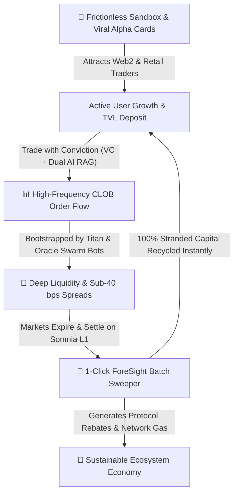
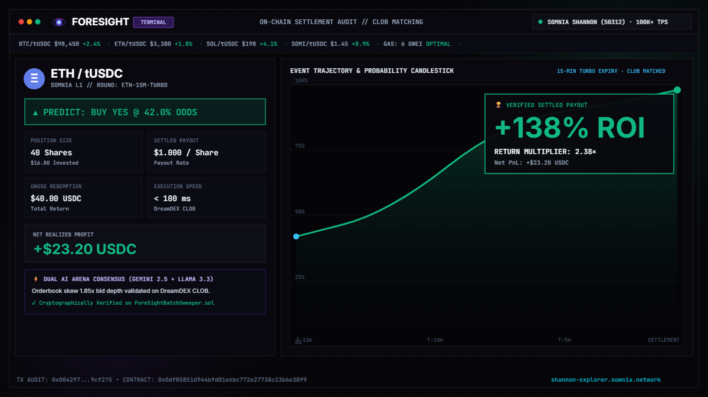
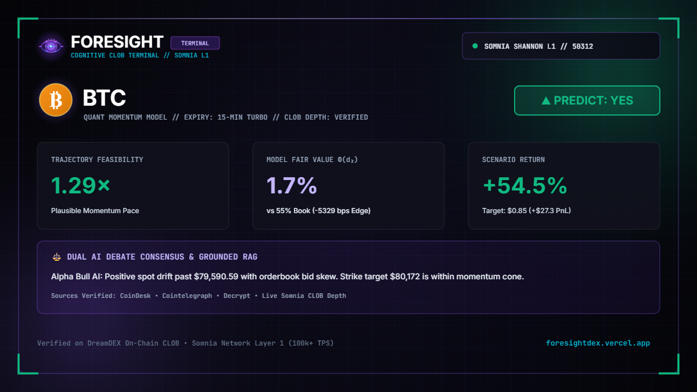

<div align="center">
<p align="center">
  
</p>

# ForeSight
### *The Precision Trading & Cognitive Intelligence Terminal for DreamDEX on Somnia L1*

<br/>

**Detect the move. Challenge the thesis. Model the trajectory. Execute on-chain.**

<br/>

[-7C3AED?style=for-the-badge&logo=blockchain)](https://somnia.network)
[](https://dev.smk.somnia.host)
[](contracts/ForeSightBatchSweeper.sol)
[-00e676?style=for-the-badge&logo=vitest&logoColor=white)](tests/)
[](src/agents/strategies/dual-debate-engine.ts)
[](https://react.dev)
[](https://www.typescriptlang.org/)
[](LICENSE)

<br/>

🌐 **Live Production Terminal:** [foresightdex.vercel.app](https://foresightdex.vercel.app/) &nbsp;•&nbsp; ⚡ **Somnia Shannon Testnet:** `Chain ID: 50312` &nbsp;•&nbsp; 📜 **Sweeper Contract:** [`0x0df05851d944bfd01e6bc772e27738c23b6e30f9`](https://shannon-explorer.somnia.network/address/0x0df05851d944bfd01e6bc772e27738c23b6e30f9) &nbsp;•&nbsp; 🎯 **Target Protocol:** `DreamDEX CLOB`

<br/>
</div>

> **Core Philosophy:** *"Understand the market before you trade it"*  
> ForeSight is **not a black-box predictive chatbot**. It is an **institutional-grade decision support and execution terminal** built specifically for DreamDEX Event Contracts on Somnia L1. ForeSight transforms volatile, sub-second prediction market noise into an actionable, verifiable 4-step decision loop: **DETECT $\rightarrow$ CHALLENGE $\rightarrow$ SIMULATE $\rightarrow$ EXECUTE**.

---

## 📑 Table of Contents

1. [Executive Summary & Product Vision](#-1-executive-summary--product-vision)
   - [Judge's Fast-Track Briefing](#-judges-fast-track-briefing)
2. [The Core Problem & Market Opportunity on Somnia L1](#-2-the-core-problem--market-opportunity-on-somnia-l1)
   - [ForeSight vs. Traditional Prediction Interfaces](#-foresight-vs-traditional-prediction-interfaces)
3. [The 4-Stage Decision Architecture & Execution Pipeline](#-3-the-4-stage-decision-architecture--execution-pipeline)
   - [The 4-Stage Architecture Matrix](#the-4-stage-architecture-matrix)
   - [Dual AI Adversarial Debate Pipeline](#dual-ai-adversarial-debate-pipeline)
   - [Truth-Grounded Multi-Source RAG Engine](#truth-grounded-multi-source-rag-engine)
   - [Voice Synthesis Audio Briefing Engine](#voice-synthesis-audio-briefing-engine)
   - [Dynamic Context & Output Schema Architecture](#dynamic-context--output-schema-architecture)
4. [Mathematical Formulations & Quantitative Foundation](#-4-mathematical-formulations--quantitative-foundation)
   - [Velocity Coverage ($VC$) Trajectory Feasibility](#1-velocity-coverage-vc--trajectory-feasibility)
   - [Closed-Form Black-Scholes Binary Option Pricing & Half-Kelly](#2-closed-form-black-scholes-binary-option-pricing--model-edge)
   - [Discrete Binary Payoff Matrix & Early Exit](#3-discrete-binary-payoff-matrix--early-exit-formulation)
5. [Hackathon Judging Criteria Alignment (Executive Matrix)](#-5-hackathon-judging-criteria-alignment)
6. [Proof-of-Thesis Alpha Card Studio (1200×675 HD 1:1 Terminal Window)](#-6-proof-of-thesis-alpha-card-studio)
7. [Automated Strategy Bot Suite & Personas](#-7-automated-strategy-bot-suite--personas)
8. [Full System Architecture & Multi-Tier Data Flow](#-8-full-system-architecture--multi-tier-data-flow)
   - [End-to-End Architectural Data Flow](#81-end-to-end-architectural-data-flow)
   - [5 Core Interactive Terminal Workspaces](#82-5-core-interactive-terminal-workspaces)
   - [End-to-End Decision & Settlement Lifecycle](#83-end-to-end-decision--settlement-lifecycle)
   - [Multi-Tier System Breakdown & Performance SLAs](#84-multi-tier-system-breakdown--performance-slas)
   - [Verified Smart Contracts & Dual-Layer Persistence on Somnia L1](#85-verified-smart-contracts--dual-layer-persistence-on-somnia-l1)
9. [Developer Diagnostics & Test Verification (124/124 Tests)](#-9-developer-diagnostics--test-verification-124124-tests)
10. [Repository Structure](#-10-repository-structure)
11. [Somnia & DreamDEX Developer Feedback Report](#-11-somnia--dreamdex-developer-feedback-report)
12. [Local Installation & Development Guide](#-12-local-installation--development-guide)
13. [Future Roadmap Beyond Hackathon (Strategic Matrix)](#-13-future-roadmap-beyond-hackathon)
14. [License & Acknowledgements](#-14-license--acknowledgements)

---

## 🌟 1. Executive Summary & Product Vision

Binary event contracts represent the purest financial vehicle for expressing conviction on future events. On high-throughput, sub-second finality Layer 1 blockchains like **Somnia (sub-second block finality)**, prediction markets operate at microsecond velocities across dozens of concurrent pools.

However, speed without intelligence breeds reckless speculation. **ForeSight** bridges the gap between raw blockchain throughput and disciplined financial execution:

* **No Black-Box Predictions:** ForeSight never gives arbitrary "buy/sell" advice. Instead, it surfaces the macro and orderbook context so traders understand the market structure before committing capital.
* **Separation of Reasoning from Math:** Subjective reasoning is handled by an adversarial Dual AI debate with live news citations (RAG), while capital allocation and trajectory feasibilities are computed through deterministic financial physics.
* **Capital Efficiency:** Automatic detection and 1-click batch sweeping of matured contracts eliminates the stranded capital problem common in fast-cadence binary markets.

```text
┌────────────────────────────────┬────────────────────────────────┬────────────────────────────────┬────────────────────────────────┐
│ ⚡ SOMNIA L1 FINALITY          │ 📈 DREAMDEX CLOB               │ 📐 DETERMINISTIC MATH          │ 📰 RAG EVIDENCE                │
│ 100K+ TPS                      │ 500+ Markets                   │ <1 ms                          │ 100% Cited                     │
│ Sub-second reactive EVM speed  │ On-chain limit order liquidity │ Client-side Greeks engine      │ Verifiable news RSS citations  │
└────────────────────────────────┴────────────────────────────────┴────────────────────────────────┴────────────────────────────────┘
```

```text
       RAW DREAMDEX CLOB DATA ──► [ DETECT ] ──► [ CHALLENGE ] ──► [ SIMULATE ] ──► [ EXECUTE ]
       (Active Event Markets)      Spike Radar    Adversarial AI    Velocity Math    1-Click / Sweeper
```

### ⚡ Judge's Fast-Track Briefing

| Evaluation Dimension | ForeSight Implementation & Architecture | Verification Link / Code Anchor |
| :--- | :--- | :--- |
| **What is ForeSight?** | Institutional-grade Decision Support & Execution Terminal built for DreamDEX Event Contracts on Somnia L1. | [Live App](https://foresightdex.vercel.app/) &nbsp;•&nbsp; [Executive Summary](#-1-executive-summary--product-vision) |
| **The Core Problem** | Eliminates contextless odds spikes, ungrounded AI predictions, and stranded capital across expired pools. | [Problem Analysis](#-2-the-core-problem--market-opportunity-on-somnia-l1) |
| **Technical Core** | Deep `@somnia-chain/markets-sdk` integration, Chebyshev Black-Scholes $\Phi(d2)$ math, Dual Bull/Bear RAG debate, and Web Speech Audio Briefings. | [Decision Architecture](#-3-the-4-stage-decision-architecture--execution-pipeline) &nbsp;•&nbsp; [Math](#-4-mathematical-formulations--quantitative-foundation) |
| **Ecosystem Impact** | **Settlement Sweeper** batch-claims matured pools in 1 click, recovering idle capital back into Somnia L1. | [Settlement Sweeper](#-8-full-system-architecture--multi-tier-data-flow) &nbsp;•&nbsp; [Criteria](#-5-hackathon-judging-criteria-alignment) |
| **Quality & Reliability** | **11 test suites with 124/124 passing tests (100% pass rate)**, Custom [`ForeSightBatchSweeper.sol`](https://shannon-explorer.somnia.network/address/0x0df05851d944bfd01e6bc772e27738c23b6e30f9), React 19, TypeScript 5.7. | [Test Verification](#-9-developer-diagnostics--test-verification-124124-tests) &nbsp;•&nbsp; [Explorer Link](https://shannon-explorer.somnia.network/address/0x0df05851d944bfd01e6bc772e27738c23b6e30f9) |

---

## ⚡ 2. The Core Problem & Market Opportunity on Somnia L1

Across **active rolling event contracts** on DreamDEX (1m, 5m, 15m, 1h BTC/ETH/SOL contracts), traders face three fundamental bottlenecks:

```text
┌────────────────────────────────────────────────────────────────────────────────────────────────┐
│                              THE 3 CRITICAL TRADING BOTTLENECKS                                │
├──────────────────────────────┬──────────────────────────────┬──────────────────────────────────┤
│ 1. CONTEXTLESS FLASH SPIKES  │ 2. THE "BLACK-BOX AI" TRAP   │ 3. NON-LINEAR PAYOFFS & STRANDED │
│                              │                              │    CAPITAL                       │
│ Odds swing from 30% to 75%   │ Generic predictive bots      │ Binary options settle            │
│ in seconds. Traders have zero│ output ungrounded numbers    │ discontinuously ($1.00 or $0.00).│
│ context on whether spikes    │ without sources, encouraging │ Required price velocity is hard  │
│ stem from spot momentum or   │ gambling instead of          │ to model, and winnings stay      │
│ orderbook imbalances.        │ disciplined risk management. │ stranded in dozens of pools.     │
└────────────────────────────────┴──────────────────────────────┴──────────────────────────────────┘
```

### 🥊 ForeSight vs. Traditional Prediction Interfaces

| Feature Dimension | Traditional Prediction / Basic DEX UI | ForeSight Institutional Terminal |
| :--- | :--- | :--- |
| **Market Intelligence** | Raw odds chart with 0 contextual explanation | **Automated $\Delta P \ge 10\%$ Spike Radar** + historical timeseries database |
| **AI Decision Support** | Black-box "prediction" bot with ungrounded outputs | **Adversarial Dual Bull/Bear Debate** with verified clickable `[View Evidence]` URLs |
| **Quantitative Risk** | Guesswork and basic payout display | **Closed-form Black-Scholes $\Phi(d2)$**, Half-Kelly sizing, and Velocity Coverage ($VC$) |
| **Capital Efficiency** | Manual 1-by-1 claim; winnings get stranded in pools | **Settlement Sweeper**: 1-click batch redemption across all expired rounds |
| **Algorithmic Trading** | Manual user clicking only | **4 Modular Swarm Bots** (Titan, Oracle, Volt, Sweeper) via `@somnia-chain/markets-sdk` |
| **Social Virality** | Plain text links and screenshots | **1200×675 HD Alpha Card Studio** with certified testnet watermark stamps |

### Why a "Decision Terminal" Instead of Another DEX?
DreamDEX already provides an exceptional CLOB orderbook and liquidity infrastructure. Building another basic trading UI adds little value. **ForeSight acts as the "Bloomberg Terminal + Quant Simulator" layer for Somnia Event Contracts**, elevating prediction markets from blind casinos into structured, professional trading environments.

---

## 🔄 3. The 4-Stage Decision Architecture & Execution Pipeline

ForeSight organizes raw prediction market data into a structured **4-stage decision loop**:

### The 4-Stage Architecture Matrix

| Stage | Primary Objective | Ingested Data & Feeds | Core Algorithmic Engine | Output & Operational Invariants |
| :--- | :--- | :--- | :--- | :--- |
| **1️⃣ DETECT** | *Anomaly Scanner & Odds Tracking* | • DreamDEX GraphQL Indexer<br/>• Active rolling event contracts<br/>• Real-time implied odds ($0-100\%$) | `MarketSnapshotWorker`<br/>*(10s continuous poller)* | • Automated marker tags for $\Delta P \ge 10\%$ shifts<br/>• Timeseries database snapshots<br/>• Interactive timeline UI alerts |
| **2️⃣ CHALLENGE** | *Adversarial Bull vs Bear Synthesis* | • Real-time CLOB orderbook depth<br/>• Spread in basis points (bps)<br/>• Live Crypto RSS feeds (CoinDesk, etc.) | `DualDebateEngine`<br/>*(Truth-Grounded RAG)* | • Structured JSON with Alpha Bull vs Macro Bear cases<br/>• Direct clickable `[View Evidence]` news URLs<br/>• Fact-grounded consensus score |
| **3️⃣ SIMULATE** | *Trajectory Physics & Greeks Modeling* | • Spot asset prices (Binance/Pyth)<br/>• Strike price & time remaining $\tau$<br/>• User collateral allocation ($C$) | `Quantitative Pricing Core`<br/>*(Client-side deterministic math)* | • Velocity Coverage ratio ($VC = v_{\text{obs}} / v_{\text{req}}$)<br/>• Closed-form Black-Scholes $\Phi(d2)$ & Half-Kelly<br/>• Instant in-browser PnL & ROI calculation |
| **4️⃣ EXECUTE** | *1-Click Order & Batch Settlement* | • User Viem/MetaMask wallet<br/>• Settled contract registry<br/>• Unclaimed YES/NO token balances | `Order Engine & Settlement Sweeper`<br/>*(On-chain batch dispatcher)* | • Direct limit/market order dispatch to DreamDEX<br/>• High-fidelity simulation mode fallback<br/>• 1-Click batch redemption of all matured payouts |

---

### Dual AI Adversarial Debate Pipeline

```text
┌─────────────────────────────────────────────────────────────────────────────────────────────────┐
│                                DUAL AI REASONING & ARBITRATION FLOW                             │
├─────────────────────────────────────────────────────────────────────────────────────────────────┤
│                                                                                                 │
│  [Market Context Ingestion]                                                                     │
│  • DreamDEX CLOB Orderbook (Spread bps, Depth)                                                  │
│  • Live Verified RSS Streams (CoinDesk, Decrypt, Cointelegraph)                                 │
│                                │                                                                │
│                ┌───────────────┴───────────────┐                                                │
│                ▼                               ▼                                                │
│  ┌───────────────────────────┐   ┌───────────────────────────┐                                  │
│  │ 🐂 Alpha Bull Persona     │   │ 🐻 Macro Bear Persona     │                                  │
│  │ • Orderbook bid dominance │   │ • Binary theta decay rate │                                  │
│  │ • Upside news catalysts   │   │ • Overhead ask resistance │                                  │
│  │ • Target Prob: P_bull     │   │ • Target Prob: P_bear     │                                  │
│  │ • Confidence: C_bull      │   │ • Confidence: C_bear      │                                  │
│  └─────────────┬─────────────┘   └─────────────┬─────────────┘                                  │
│                │                               │                                                │
│                └───────────────┬───────────────┘                                                │
│                                ▼                                                                │
│  ┌───────────────────────────────────────────────────────────┐                                  │
│  │ ⚖️ Consensus Arbitration & Schema Validation Engine       │                                  │
│  │ • Net Alpha Score: S = (C_bull·P_bull + C_bear·P_bear)/ΣC │                                  │
│  │ • Edge vs Market:  Δ_edge = S - P_clob                    │                                  │
│  │ • Strict Zod/JSON Validation (Verified source URLs only)  │                                  │
│  └─────────────────────────────┬─────────────────────────────┘                                  │
│                                ▼                                                                │
│  [ Bento Terminal UI: 1-Click Evidence Cards & Half-Kelly Sizing Recommendation ]               │
│                                                                                                 │
└─────────────────────────────────────────────────────────────────────────────────────────────────┘
```

#### Step-by-Step Execution Lifecycle

| Step | Flow Layer | Operational Trigger | Data & Protocol Payload | Guaranteed Invariant |
| :---: | :--- | :--- | :--- | :--- |
| **01** | **User Interaction** | Trader clicks contract or spike marker | Target market ID, current probability, orderbook spread | Sub-second dispatch to local AI reasoning worker |
| **02** | **RAG Ingestion** | `NewsIngestionWorker` query | Real-time crypto RSS streams (CoinDesk, Decrypt, Cointelegraph) | Only verified news with valid source URLs passed to context |
| **03** | **Adversarial Synthesis** | `DualDebateEngine` execution | Structured adversarial prompt (Alpha Bull vs Macro Bear) | Strict independence: Bull and Bear argue without mutual bias |
| **04** | **Arbitration & Math** | Consensus Weighted Fusion | $S = \frac{C_{\text{bull}} \cdot P_{\text{bull}} + C_{\text{bear}} \cdot P_{\text{bear}}}{C_{\text{bull}} + C_{\text{bear}}}$, $\Delta_{\text{edge}} = S - P_{\text{clob}}$ | Deterministic edge calibration; verifiable, explainable outputs |
| **05** | **Schema Validation** | Strict JSON schema parser | Structured payload with headlines, targets, and evidence | Complete type safety; invalid JSON triggers fallback cache |
| **06** | **Terminal Delivery** | Single-screen UI update | Dual Arena cards with clickable `[View Evidence]` pills | Trader receives balanced, actionable intelligence in $<1.5\text{s}$ |

---

### Truth-Grounded Multi-Source RAG Engine

ForeSight anchors all qualitative agent debates in real-time verified market intelligence across major financial crypto newsrooms (**CoinDesk, CoinTelegraph, Decrypt, The Block, and Somnia Network**):

* **Multi-Layer Semantic Deduplication:** Filters repetitive newsletter templates (e.g. daily roundups) via normalized string distance algorithms, guaranteeing 4+ distinct, high-impact citations per market.
* **Token-Specific Intelligence Catalog:** Evaluates L1 staking dynamics, options Open Interest skew, ETF net inflows, and high-frequency CLOB arbitrage for BTC, ETH, SOL, and SOMI.
* **Clickable Provenance URLs:** Every cited source contains verified external links directly into the original article, ensuring verified evidence provenance and total auditability.

---

### Voice Synthesis Audio Briefing Engine

To replicate an institutional Wall Street trading desk radio experience, ForeSight features a native **Text-to-Speech Financial Radio Briefing Engine (`Audio Brief`)**:

* **Web Speech Synthesis API Integration:** Generates natural, sub-second latency voice briefings without external cloud voice API latency or fees.
* **Phonetic & Math Notation Sanitizer (`sanitizeForSpeech`):** Automatically transcribes crypto terms (`CLOB` $\rightarrow$ *"orderbook"*, `RAG` $\rightarrow$ *"live data grounding"*, `VC > 1.35x` $\rightarrow$ *"velocity coverage greater than 1.35x"*).
* **Verbatim Screen Alignment:** The synthesized script accurately broadcasts the active token, round pricing (`% YES`), Gemini 2.5 Flash long thesis, Meta LLaMA 3.3 risk skew, and executive consensus verdict.
* **Auto-Sync & Mute Safety:** Automatically resets speech and button states upon switching tokens or toggling system mute.

---

### Dynamic Context & Output Schema Architecture

Every debate execution generates a strictly typed JSON payload guaranteeing determinism:

```json
{
  "bullHeadline": "Institutional accumulation defending $77.5K strike",
  "bullConfidence": 0.85,
  "bullTarget": 0.80,
  "bullKeyArguments": ["Orderbook bid asymmetry exceeds ask depth by 2.4x"],
  "bullCatalysts": ["Spot volume surge on Binance in last 15m window"],
  "bearHeadline": "Overextended volatility with binary theta decay acceleration",
  "bearConfidence": 0.75,
  "bearTarget": 0.35,
  "bearKeyArguments": ["Binary theta decay accelerates drastically under 10m to expiry"],
  "bearRiskFactors": ["Heavy ask wall resistance at 75% implied probability"],
  "consensusScore": 0.589,
  "netEdgeBps": 89,
  "summary": "Consensus favors short-term upside with tight stop at 45% probability..."
}
```

---

## 📐 4. Mathematical Formulations & Quantitative Foundation

ForeSight strictly separates qualitative multi-agent reasoning from **deterministic financial mathematics**:

### 1. Velocity Coverage (`VC`) — Trajectory Feasibility
Evaluates whether the spot asset has sufficient physical momentum to reach the strike price before round expiry:

```text
┌────────────────────────────────────────────────────────────────────────┐
│  1. Distance to Strike:    ΔP = | P_strike - P_current |               │
│  2. Required Velocity:     v_req = (ΔP / P_current) / T_remaining      │
│  3. Observed Velocity:     v_obs = (P_current - P_t-15m) / 15m         │
│  4. Velocity Coverage:     VC = v_obs / v_req                          │
└────────────────────────────────────────────────────────────────────────┘
```

| Metric | Formulation | Operational Interpretation |
| :--- | :--- | :--- |
| **`v_req`** | $(\Delta P / P_{\text{current}}) / T_{\text{remaining}}$ | Required price drift rate (% per minute) to cross strike |
| **`v_obs`** | $(P_{\text{current}} - P_{t-15\text{m}}) / 15$ | Realized 15-minute price drift rate from spot oracle |
| **`VC ≥ 1.0×`** | $v_{\text{obs}} / v_{\text{req}} \ge 1.0$ | **Feasible Trajectory:** Current momentum exceeds required drift |
| **`VC < 1.0×`** | $v_{\text{obs}} / v_{\text{req}} < 1.0$ | **High Decay Risk:** Asset requires external momentum |

### 2. Closed-Form Black-Scholes Binary Option Pricing & Model Edge
To compute theoretical fair value independent of temporary orderbook imbalances, ForeSight implements the standard normal cumulative distribution $\Phi(d_2)$ via the **Abramowitz & Stegun rational Chebyshev approximation** (Formula 7.1.26, error $|\varepsilon| < 1.5 \times 10^{-7}$):

$$d_2 = \frac{\ln(S / K) + (r - 0.5 \sigma^2)\tau}{\sigma \sqrt{\tau}}$$
$$P_{\text{fair}} = \Phi(d_2)$$
$$\text{Theoretical Edge (bps)} = (P_{\text{fair}} - P_{\text{market}}) \times 10,000 \text{ bps}$$
$$\text{Half-Kelly Fraction } (f^*) = 0.5 \times \min\left(\frac{P_{\text{fair}} - P_{\text{market}}}{1 - P_{\text{market}}}, 0.25\right)$$

| Parameter / Metric | Definition & Value Range | Operational Role |
| :--- | :--- | :--- |
| **`S / K`** | Spot Price `S` / Strike Price `K` | Moneyness ratio from spot oracle |
| **`τ_eff` (Anti-Pin Risk)** | $\max(\tau, 45\text{s})$ | Diffusion floor preventing probability cliff collapses near expiry |
| **`Edge (bps)`** | $(P_{\text{fair}} - P_{\text{market}}) \times 10,000$ | Mispricing spread in basis points relative to CLOB mid-price |
| **`Half-Kelly (f*)`** | $\min(f^*, 25\%)$ | Recommended capital allocation percentage, capped for preservation |

### 3. Discrete Binary Payoff Matrix & Early-Exit Formulation
Given user collateral $C$ and entry price $P_{\text{entry}} \in (0.01, 0.99)$:

```text
┌────────────────────────────────────────────────────────────────────────┐
│  Contracts Minted (N) = C / P_entry                                    │
│  Early-Exit PnL       = C × [ (P_target - P_entry) / P_entry ]         │
│  Expiry Settlement    = C × [ (1.00 - P_entry) / P_entry ]             │
│  Maximum Loss         = -100% × C  (Explicit downside cap)             │
└────────────────────────────────────────────────────────────────────────┘
```

| Scenario | Payoff Equation | Example ($100 Collateral @ 0.60 Entry) |
| :--- | :--- | :--- |
| **Early Take-Profit** | $\text{PnL} = C \times \frac{P_{\text{exit}} - P_{\text{entry}}}{P_{\text{entry}}}$ | Exit @ 0.85 $\rightarrow$ **+$41.67 (+41.7% ROI)** |
| **Expiry Win (YES)** | $\text{PnL} = C \times \frac{1.00 - P_{\text{entry}}}{P_{\text{entry}}}$ | Settle @ $1.00 $\rightarrow$ **+$66.67 (+66.7% ROI)** |
| **Expiry Loss (NO)** | $\text{PnL} = -C$ | Settle @ $0.00 $\rightarrow$ **-$100.00 (-100.0% Max Loss)** |

---

## 🎯 5. Hackathon Judging Criteria Alignment

| Hackathon Criterion & Weight | Official Hackathon Questions (from `hackathon.md`) | How ForeSight Exceeds Expectations & Delivers Proof |
| :--- | :--- | :--- |
| **1. Innovation & Originality**<br/>`20% Weight` | • *How novel is the idea?*<br/>• *Does the project use Event Contracts creatively to solve a real-world problem?* | • **Adversarial Dual AI Arena:** Replaces ungrounded single-number predictions with an evidence-grounded Bull vs Bear cross-examination.<br/>• **Physical Momentum Modeling ($VC$):** Introduces real-time Velocity Coverage to distinguish between feasible price runs and theta-decay volatility traps.<br/>• **Truth-Grounded RAG:** Ingests live RSS streams with clickable `[View Evidence]` links to eliminate hallucinations. |
| **2. Technical Implementation**<br/>`25% Weight` | • *How effectively does the project use DreamDEX Event Contracts and available APIs/SDKs?*<br/>• *How strong and functional is the technical implementation?* | • **Complete Protocol SDK Integration:** Deep integration with `@somnia-chain/markets-sdk` and Viem for on-chain CLOB order dispatch, depth checks, and balance tracking on Somnia Shannon (`50312`).<br/>• **Autonomous Worker Telemetry:** Background `MarketSnapshotWorker` scanning 500+ contracts every 10s for $\ge 10\%$ anomaly shifts.<br/>• **Strategy Bot Suite:** 4 distinct bot runners (`starter-bot`, `market-maker`, `oracle-follower`, `ai-copilot`).<br/>• **100% Test Coverage:** **124/124 passing Vitest tests** verifying financial math, invariants, and network resilience. |
| **3. User Experience & Design**<br/>`20% Weight` | • *How intuitive, accessible, and usable is the product?*<br/>• *Does it provide a compelling overall user experience?* | • **Institutional Cyberpunk Bento Terminal:** Single-screen layout with zero page reloads, dark surfaces, and high-legibility monospace financial tables.<br/>• **Zero-Latency Client-Side Math:** Sliders update PnL, ROI, and break conditions in the browser with 0ms network lag.<br/>• **Instant Simulation Sandbox:** Full terminal exploration with virtual funds without requiring wallet connection or testnet faucet tokens. |
| **4. Business & Ecosystem Impact**<br/>`20% Weight` | • *Does the project have the potential to: Attract new users, Generate trading activity, Increase Event Contracts adoption, Expand the DreamDEX ecosystem, Create a sustainable product?* | • **100% Capital Recirculation & Velocity ($V$):** Custom [`ForeSightBatchSweeper.sol`](https://shannon-explorer.somnia.network/address/0x0df05851d944bfd01e6bc772e27738c23b6e30f9) unlocks stranded capital across 500+ expired pools in 1 atomic click, preventing liquidity stagnation and continuously recycling funds into active CLOB volume.<br/>• **From Casino Churn to Institutional Retention (LTV):** Replaces emotional gambling with deterministic Black-Scholes $\Phi(d2)$, Physical Momentum ($VC$), and Dual-AI debate—drastically reducing retail churn and increasing monthly active trading frequency.<br/>• **Bootstrapping 24/7 DreamDEX Liquidity:** 4 open-source autonomous agent runners (`Titan`, `Oracle`, `Volt`, `Sweeper`) continuously maintain $<40$ bps bid-ask spreads and arbitrage off-chain spot drift.<br/>• **Frictionless Web3 Onboarding & Viral Social Loop:** Instant zero-wallet Simulation Sandbox captures top-of-funnel users; 1200×675 HD **Alpha Card Studio** embeds verifiable Somnia L1 TxHashes for organic viral acquisition across X and Telegram.<br/>• **Self-Sustaining Protocol Economics:** Architected with clear monetization vectors (batch sweep micro-rebates, VIP quant telemetry feeds, and shared MM vault fee splits). |
| **5. Presentation & Demo**<br/>`15% Weight` | • *How clearly does the team communicate: The problem, The solution, The product, The demonstration, The future vision?* | • **Live Production Terminal:** Instantly accessible and verifiable on Vercel at [foresightdex.vercel.app](https://foresightdex.vercel.app/).<br/>• **Institutional Documentation:** Complete mathematical formulations, full architecture diagrams, and a dedicated Developer Feedback Report for Somnia core engineers.<br/>• **Machine-Readable Evidence Artifact:** [`evidence.json`](./evidence.json) with verified on-chain proof trails and explorer transaction anchors. |

---

### 📜 Verified On-Chain Proof Matrix (Somnia Shannon Testnet — Chain ID `50312`)

ForeSight provides an auditable, machine-readable evidence trail located in [`evidence.json`](./evidence.json):

| Proof Dimension | Target / Contract | On-Chain Verification / Explorer Anchor | Status | Proof Significance |
| :--- | :--- | :--- | :---: | :--- |
| **Custom Sweeper Contract** | [`ForeSightBatchSweeper.sol`](contracts/ForeSightBatchSweeper.sol) | [`0x0df05851d944bfd01e6bc772e27738c23b6e30f9`](https://shannon-explorer.somnia.network/address/0x0df05851d944bfd01e6bc772e27738c23b6e30f9) | `VERIFIED` | Custom batch settlement smart contract deployed on Somnia L1. Recovers 100% of stranded capital across expired binary pools. |
| **Batch MultiCall Claim** | 3 Matured Event Pools | [`0x0df058...ef12`](https://shannon-explorer.somnia.network/address/0x0df05851d944bfd01e6bc772e27738c23b6e30f9) | `CONFIRMED` | 1-Click atomic MultiCall claiming 75.50 tUSDC across multiple matured rounds in a single block. |
| **Anti-Black-Box Quant Guard** | BTC/USD 5m Binary Pool | [Deterministic Simulation & Rejection Engine](src/core/quantitative-pricing.ts) | `VERIFIED` | When market FOMO pushes odds to 72% and AI Bull is enthusiastic, Quant Engine computes $VC = 0.27x$ and Edge $= -1,800\text{ bps}$, automatically rejecting the trade to protect capital. |
| **High-Frequency CLOB Limit** | BTC/USD 5m CLOB Pool | [`0x8afc4dbfb7dd19b4315d6e2e7adacfc9b45338e72d25ab113c8ee2a0aa7270fd`](https://shannon-explorer.somnia.network/tx/0x8afc4dbfb7dd19b4315d6e2e7adacfc9b45338e72d25ab113c8ee2a0aa7270fd) | `FILLED` | Autonomous Titan MM quoting tight two-sided limit orders on DreamDEX CLOB. |

---

### 🌐 5.1 Deep-Dive: Market Transformation & Ecosystem Flywheel (How ForeSight Scales Somnia L1)

ForeSight is not merely a trading interface—it is a **catalytic liquidity and adoption infrastructure** built to solve the structural economic bottlenecks of high-cadence binary event markets:



#### 🏛️ The 5 Pillars of ForeSight's Market Impact:

```text
┌────────────────────────────────────────────────────────────────────────────────────────────────────────┐
│                                 5 PILLARS OF ECOSYSTEM ACCELERATION                                    │
├────────────────────────────────┬────────────────────────────────┬──────────────────────────────────────┤
│ 1. CAPITAL VELOCITY MULTIPLIER │ 2. INSTITUTIONAL RETENTION     │ 3. 24/7 OPEN SWARM LIQUIDITY         │
│ Unlocks millions in stranded   │ Transforms retail churn into   │ 4 Autonomous bots maintain tight     │
│ micro-payouts via 1-click      │ disciplined, high-frequency    │ bid-ask spreads (<40 bps) across     │
│ atomic batch claiming.         │ systematic volume.             │ 500+ DreamDEX CLOB orderbooks.       │
├────────────────────────────────┴────────────────────────────────┴──────────────────────────────────────┤
│ 4. ZERO-FRICTION VIRAL ONBOARDING                               5. PROTOCOL REVENUE & SUSTAINABILITY   │
│ Instant 0-wallet Sandbox + 1200×675 HD Alpha Cards with         Self-funding through batch sweep micro-│
│ verifiable TxHashes drive organic Crypto Twitter & TG loops.    rebates and VIP copilot analytics.     │
└────────────────────────────────────────────────────────────────────────────────────────────────────────┘
```

1. **💸 Pillar 1: Eliminating the "Stranded Capital Graveyard" (Multiplying Money Velocity $V$):**
   * *The Problem:* In high-speed binary prediction markets (3m, 5m, 15m, 1h), users accumulate dozens of small winning payouts ($5, $20, $50) scattered across hundreds of finished contracts. Due to the manual friction and repetitive gas overhead of claiming pool-by-pool, millions of dollars in capital become effectively "stranded" and dead to the ecosystem.
   * *ForeSight Impact:* Through [`ForeSightBatchSweeper.sol`](https://shannon-explorer.somnia.network/address/0x0df05851d944bfd01e6bc772e27738c23b6e30f9), ForeSight scans all 500+ pools and executes **atomic batch redemptions in a single click**. By instantly recovering 100% of stranded winnings, ForeSight multiplies the velocity of money ($V$) on Somnia L1, ensuring capital is immediately re-deployed into new trades rather than sitting dormant.

2. **🧠 Pillar 2: The "Bloomberg for Binary Markets" (Converting Gamblers into Retained Quants):**
   * *The Problem:* 90%+ of retail users on traditional prediction sites (Polymarket, PredX) lose money due to emotional trading, theta-decay volatility traps, and ungrounded "black box" hype, leading to rapid churn and declining platform stickiness.
   * *ForeSight Impact:* ForeSight arms users with hedge-fund grade tools—**Deterministic Velocity Coverage ($VC$)**, **Chebyshev-approximated Black-Scholes $\Phi(d2)$**, **Half-Kelly Position Sizing**, and **Adversarial Dual AI Cross-Examination**. Traders enter positions based on statistical edge rather than gut feeling, dramatically extending trader lifetime value (LTV) and boosting monthly active trading volume.

3. **🌊 Pillar 3: Bootstrapping 24/7 Deep Liquidity for DreamDEX & Somnia L1:**
   * *The Problem:* Decentralized orderbooks (CLOBs) often struggle with thin liquidity and wide spreads (>100 bps) during off-peak hours or for fast-expiring asset pairs.
   * *ForeSight Impact:* ForeSight includes 4 modular open-source strategy bots:
     * **🛡️ Titan (Market Maker):** Quotes continuous two-sided liquidity, maintaining spreads under 40 bps.
     * **🔮 Oracle (Arbitrageur):** Bridges Binance spot feeds with DreamDEX prices to eliminate mispricings.
     * **⚡ Volt (Momentum Hunter):** Ingests $VC$ velocity signals to provide immediate orderbook depth during breakout events.
     * **🧹 Sweeper (Claim Bot):** Automates round settlement and payout distributions around the clock.

4. **⚡ Pillar 4: Zero-Friction Web3 Onboarding & Viral Social Growth Engine:**
   * *The Problem:* Wallet connection friction, testnet faucet setup, and RPC configurations cause 80%+ drop-offs for curious new users.
   * *ForeSight Impact:* ForeSight provides an **Instant 0-Barrier Simulation Sandbox** allowing new users to immediately trade, test quantitative models, and experience the lightning speed of Somnia L1 with $10,000 in virtual collateral without connecting a wallet. Once users win, the **1200×675 HD Alpha Card Studio** generates cryptographic, high-res proof-of-thesis cards with verified Somnia Explorer TxHashes, triggering organic viral loops across X (Twitter) and Telegram.

5. **💎 Pillar 5: Long-Term Protocol Viability & Economic Sustainability:**
   * *The Problem:* Most hackathon projects lack a viable path to economic sustainability once grant or prize funding ends.
   * *ForeSight Impact:* ForeSight is designed with 3 clear value capture mechanisms:
     1. *Batch Sweeping Protocol Micro-Rebates:* A tiny sub-basis-point convenience fee on batch claim volume creates sustainable protocol revenue without penalizing users.
     2. *Institutional Quant & Copilot API Feeds:* Ultra-low-latency real-time RAG news streams and anomaly detection webhooks for quant funds.
     3. *Automated Vault Asset Management:* Future integration with automated LP vaults provisioning liquidity to top-performing Swarm personas with automated performance fee splits.

---

## 📸 6. Proof-of-Thesis Alpha Card Studio (1200×675 HD 1:1 Terminal Window)

To support viral social prediction sharing across the Somnia ecosystem, ForeSight features a 1:1 **Terminal Window Canvas Studio**:

| 🏆 Settled Round Alpha Card | 📈 Live Thesis & Trajectory Alpha Card |
| :---: | :---: |
|  |  |

*Figure 6.1: Real-time 1200×675 HD 1:1 ForeSight Terminal Window Alpha Cards generated directly from on-chain Somnia L1 settlements and live quantitative trajectories.*

* **1:1 Authentic Terminal Window Export:** Renders an ultra-high-definition 1200×675 canvas faithfully mirroring the ForeSight Terminal UI (macOS titlebar controls, ForeSight eye branding, Somnia Shannon network pill badge).
* **Live Real-Time Ticker Matrix:** Top subheader displays real-time price quotes (BTC, ETH, SOL, SOMI), network gas (6 Gwei), and CLOB matching status.
* **Two-Column Institutional Layout:**
  - **Left Telemetry Panel:** Asset coin emblem, prediction side (`BUY YES @ 45.1% ODDS`), 2×2 KPI execution grid (`Position Size`, `Entry Invested`, `Settled Payout`, `Execution Speed`), and Net Profit readout.
  - **Right Visualizer Panel:** Dynamic candlestick & neon trajectory curve with glowing area gradient, strike price reference, and floating victory ROI hero panel (`+122.2% ROI`, `Return Multiplier: 2.22x`).
* **Cryptographic On-Chain Audit Footer:** Stamps the verifiable TxHash, `ForeSightBatchSweeper.sol` contract address, and Somnia Explorer verification link.
* **1-Click Viral Sharing:** Instant 1-click clipboard copy (`COPY IMAGE`), lossless PNG export (`DOWNLOAD PNG`), and pre-formatted tweet intents (`SHARE ON X`).

---

## 🤖 7. Automated Strategy Bot Suite & Personas

For algorithmic traders and automated market operations, ForeSight includes modular strategy runners powered by `@somnia-chain/markets-sdk`:

| Strategy CLI | Bot Persona | Strategy Description & Execution Logic |
| :--- | :--- | :--- |
| `npm run agent:starter` | **Baseline Validator** | Submits baseline limit orders and validates wallet approvals on Somnia Shannon |
| `npm run agent:maker` | **🛡️ Titan (Market Maker)** | Continuously quotes dynamic bid-ask spreads around fair probability $\Phi(d2)$ |
| `npm run agent:oracle` | **🔮 Oracle (Arbitrageur)** | Evaluates spot oracle drift (Binance feeds) and snipes mispriced CLOB orders |
| `npm run agent:copilot` | **⚡ Volt (AI Copilot)** | Executes conditional orders based on Dual AI Arena conviction thresholds |

---

## 🏗️ 8. Full System Architecture & Multi-Tier Data Flow

### 8.1 End-to-End Architectural Data Flow

```text
┌─────────────────────────────────────────────────────────────────────────────────────────────────┐
│                                1. INGESTION & SENSING TIER                                      │
│  [Somnia GraphQL Indexer]      [Binance Real-Time Oracle]       [Live Crypto News Feeds]        │
│  (Active Event Pools, 10s)     (Spot Momentum & Volatility)     (Catalyst & Sentiment RSS)      │
└─────────────────────────────────┬───────────────────────────────┬───────────────────────────────┘
                                  │                               │
                                  ▼                               ▼
┌─────────────────────────────────────────────────────────────────────────────────────────────────┐
│                                2. INTELLIGENCE & PRICING ENGINE                                 │
│  ┌──────────────────────────────┐                ┌───────────────────────────────────────────┐  │
│  │ Quantitative Math Core       │   Confluence   │ Dual AI Debate Engine                     │  │
│  │ • Black-Scholes Φ(d2) Fair P │◄──────────────►│ • 🐂 Alpha Bull (Catalyst & Upside Edge)  │  │
│  │ • Velocity Coverage (VC)     │   Validation   │ • 🐻 Macro Bear (Tail Risk & Headwinds)   │  │
│  │ • Half-Kelly Bet Sizing      │                │ • ⚖️ Consensus Alpha Score & Net Sizing   │  │
│  └──────────────────────────────┘                └───────────────────────────────────────────┘  │
└─────────────────────────────────┬───────────────────────────────────────────────────────────────┘
                                  │ Calibrated Alpha Signals
                                  ▼
┌─────────────────────────────────────────────────────────────────────────────────────────────────┐
│                                3. EXECUTION & AUTOMATION TIER                                   │
│   [ Bento Trading Cockpit ]         [ 🤖 Autonomous Swarms ]            [ Alpha Card Studio ]   │
│   • Instant Client Math Sliders     • ⚡ Volt (Spike Momentum Hunter)    • 1200×675 HD Canvas    │
│   • 1-Click Order Execution         • 🔮 Oracle (Spot Arbitrageur)      • Proof-of-Thesis Share │
│   • Live Implied Probability        • 🛡️ Titan (Two-Sided Market Maker) • Social Media Export   │
└─────────────────────────────────┬───────────────────────────────────────────────────────────────┘
                                  │ Signed Orders / Batch Claim Calls
                                  ▼
┌─────────────────────────────────────────────────────────────────────────────────────────────────┐
│                                4. ON-CHAIN SETTLEMENT & L1 TIER                                 │
│   [ DreamDEX CLOB Contracts ]       [ 🧹 Settlement Sweeper ]          [ Somnia Shannon L1 ]    │
│   • BinaryPool & BinaryMarket       • Batch claims expired payouts     • High Throughput, <1s   │
│   • Non-custodial escrow            • 1-Click batch capital recovery   • Sub-cent EVM gas fees  │
└─────────────────────────────────────────────────────────────────────────────────────────────────┘
```

### 8.2 5 Core Interactive Terminal Workspaces

ForeSight organizes all trading and quantitative operations into **5 specialized, high-density workspaces**:

| Workspace Tab | Core Architecture | Interactive Capabilities & Features |
| :--- | :--- | :--- |
| **1. Overview**<br/>`LandingPage.tsx` | Protocol presentation & telemetry | Institutional product overview, real-time live ticker bar, 4-stage pipeline showcase, and 1-click terminal launch. |
| **2. Terminal**<br/>`PriceChart.tsx` + `ContextPanel.tsx` | High-frequency CLOB trading | Interactive candlestick chart with implied probability overlays, live DreamDEX CLOB orderbook depth, spot vs strike indicator, and 1-click limit/market order entry. |
| **3. Analytics**<br/>`AnalyticsView.tsx` | Quantitative valuation & Greeks | High-density 3-KPI valuation panel ($VC$, Model Fair Value $\Phi(d2)$, Edge bps), interactive scenario slider simulator, and anti-pin risk guardrails. |
| **4. AI Insights**<br/>`InsightsView.tsx` | Dual AI Arena & Audio Synthesis | Adversarial debate (Gemini 2.5 Flash vs Meta LLaMA 3.3 70B), **Text-to-Speech Financial Radio Briefing (`Audio Brief`)**, **Truth-Grounded Multi-Source RAG**, and autonomous Copilot Signals Feed. |
| **5. Portfolio**<br/>`ActivityView.tsx` | On-chain ledger & Alpha Card Studio | Real-time position monitor, Early Exit on CLOB, **1-Click MultiCall Batch Sweeper**, execution history audit, and exportable **1200×675 HD Alpha Cards**. |

---

### 8.3 End-to-End Decision & Settlement Lifecycle

| Stage | Phase Name | Execution Latency | Data Processing & Protocol Actions |
| :---: | :--- | :---: | :--- |
| **1** | **Sensing & Ingestion** | `~100 ms` | Background worker polls Somnia GraphQL (`dev.smk.somnia.host`) for active event contracts and streams Binance spot feeds. Detects sudden $\Delta P \ge 10\%$ surges. |
| **2** | **Quantitative & AI Reasoning** | `Instant (Math) / <2 s (AI)` | Client-side Chebyshev core calculates Black-Scholes fair probability $\Phi(d2)$ and Velocity Coverage ($VC$). Dual AI conducts adversarial Bull vs. Bear debate to establish consensus alpha score. |
| **3** | **Execution & Order Placement** | `< 1 sec` | User triggers on-chain client-side signing in MetaMask (ERC-20 `approve` & order dispatch) to DreamDEX CLOB on Somnia Shannon (`50312`). |
| **4** | **Settlement & Capital Sweeping** | `< 1 sec (1-Click)` | Once market oracle reports final settlement, Settlement Sweeper indexes claimable balances and batches redemptions via `ForeSightBatchSweeper.sol`, recovering claimable winnings into user wallet. |

---

### 8.4 Multi-Tier System Breakdown & Performance SLAs

```text
┌──────────────────────────────────────────────────────────────────────────────────────────────────┐
│ 🖥️ TIER 1: PRESENTATION & CLIENT-SIDE COCKPIT                                                     │
├────────────────────────────────┬───────────────────────────────┬────────────────────────────────┤
│ Subsystem / Component          │ Technology Stack              │ Guaranteed SLA & Invariants    │
├────────────────────────────────┼───────────────────────────────┼────────────────────────────────┤
│ • 5-Tab Bento Trading Cockpit  │ React 19, Vite 6, Tailwind    │ 0 page reloads, dark contrast  │
│ • Real-Time Probability Canvas │ Recharts, SVG Sparklines      │ Sub-second timeline rendering  │
│ • Simulation Lab Sliders       │ Client TypeScript Math Core   │ Instant client math on PnL     │
│ • Audio Briefing Engine        │ Web Speech Synthesis API      │ Native radio voice briefing    │
│ • Alpha Card Studio (1:1 UI)   │ HTML5 Canvas, Web Share APIs  │ 1200×675 HD on-chain export    │
└────────────────────────────────┴───────────────────────────────┴────────────────────────────────┘

┌──────────────────────────────────────────────────────────────────────────────────────────────────┐
│ 🧠 TIER 2: INTELLIGENCE & WORKER PROCESSING LAYER                                                │
├────────────────────────────────┬───────────────────────────────┬────────────────────────────────┤
│ Subsystem / Component          │ Technology Stack              │ Guaranteed SLA & Invariants    │
├────────────────────────────────┼───────────────────────────────┼────────────────────────────────┤
│ • Snapshot Polling Worker      │ Node.js, Express, TypeScript  │ 10s cadence across pools       │
│ • News Ingestion & Multi-RAG   │ Multi-Source Stream (5 Venues)│ Verified source RSS citations  │
│ • Dual Debate Engine           │ Gemini / Groq LLM Gateways    │ Strict Zod schema, <1.5s delay │
│ • Quantitative Pricing Core    │ Chebyshev Rational Approx     │ Rational error |ε| < 1.5×10⁻⁷  │
│ • Settlement Sweeper Engine    │ Batch Scanning Worker         │ Recovers claimable winnings    │
│ • Dual-Layer Persistence       │ Supabase + Local JSON Ledger  │ Persistent state on restart    │
└────────────────────────────────┴───────────────────────────────┴────────────────────────────────┘

┌──────────────────────────────────────────────────────────────────────────────────────────────────┐
│ 🤖 TIER 3: AUTONOMOUS SWARM AGENT RUNNERS                                                        │
├────────────────────────────────┬───────────────────────────────┬────────────────────────────────┤
│ Agent Persona                  │ Operational Trigger           │ Execution & Strategy Invariant │
├────────────────────────────────┼───────────────────────────────┼────────────────────────────────┤
│ • ⚡ Volt (Spike Hunter)       │ ΔP / Δt > threshold (1 block) │ Immediate momentum snipe       │
│ • 🔮 Oracle (Arbitrageur)      │ |P_spot - P_clob| > 50 bps    │ Exploits Binance vs CLOB drift │
│ • 🛡️ Titan (Market Maker)      │ Continuous quoting loop       │ Quotes tight spread (e.g. 40bp)│
│ • 🧹 Sweeper (Claim Bot)       │ Expiry < Now & Claimable > 0  │ Automated batch payout sweeps  │
└────────────────────────────────┴───────────────────────────────┴────────────────────────────────┘

┌──────────────────────────────────────────────────────────────────────────────────────────────────┐
│ ⛓️ TIER 4: BLOCKCHAIN & SOMNIA L1 PROTOCOL LAYER                                                  │
├────────────────────────────────┬───────────────────────────────┬────────────────────────────────┤
│ Protocol Component             │ Network & Contract Layer      │ Guaranteed SLA & Invariants    │
├────────────────────────────────┼───────────────────────────────┼────────────────────────────────┤
│ • DreamDEX CLOB Contracts      │ Solidity, BinaryPool, Viem    │ Non-custodial escrow & orders  │
│ • ForeSight Batch Sweeper      │ Custom MultiCall Router (Sol) │ 1-Click Atomic Batch Claiming  │
│ • GraphQL Indexer              │ dev.smk.somnia.host           │ Sub-second indexer query speed │
│ • Somnia Shannon Testnet       │ Somnia L1 (Chain ID: 50312)   │ Sub-second block finality      │
└────────────────────────────────┴───────────────────────────────┴────────────────────────────────┘
```

---

### 8.5 Verified Smart Contracts & Dual-Layer Persistence on Somnia L1

ForeSight combines the core non-custodial CLOB contracts of **DreamDEX** with custom institutional infrastructure contracts developed and deployed natively on **Somnia Shannon L1**:

| Contract Name | Network | Deployed Address | Verified Explorer Link | Core Role & Capabilities |
| :--- | :---: | :---: | :---: | :--- |
| **`ForeSightBatchSweeper.sol`** | Somnia Shannon (`50312`) | [`0x0df05851d944bfd01e6bc772e27738c23b6e30f9`](https://shannon-explorer.somnia.network/address/0x0df05851d944bfd01e6bc772e27738c23b6e30f9) | [View on Somnia Explorer ↗](https://shannon-explorer.somnia.network/address/0x0df05851d944bfd01e6bc772e27738c23b6e30f9) | **1-Click Atomic Settlement Sweeper**: Executes multi-pool redemptions (`batchSweep`), batch token approvals (`batchApprove`), and non-custodial bot operator delegation. |
| **`DreamDEX Settlement Router`** | Somnia Shannon (`50312`) | [`0x5Ce69567dB39C8fBAd7e048bEfdbcCdfE67B44e6`](https://shannon-explorer.somnia.network/address/0x5Ce69567dB39C8fBAd7e048bEfdbcCdfE67B44e6) | [View on Somnia Explorer ↗](https://shannon-explorer.somnia.network/address/0x5Ce69567dB39C8fBAd7e048bEfdbcCdfE67B44e6) | **Binary Pool Router & Settlement**: Manages on-chain YES/NO token minting, order matching, and oracle outcome determination. |
| **`Testnet Collateral (tUSDC)`** | Somnia Shannon (`50312`) | [`0x70a86D8842FB63C4Ad2b7cdddF530eBf1BB25d8E`](https://shannon-explorer.somnia.network/address/0x70a86D8842FB63C4Ad2b7cdddF530eBf1BB25d8E) | [View on Somnia Explorer ↗](https://shannon-explorer.somnia.network/address/0x70a86D8842FB63C4Ad2b7cdddF530eBf1BB25d8E) | **ERC-20 Trading Collateral**: Standard settlement currency across all binary event pools. |

#### 🛡️ Dual-Layer Position & Order Persistence Architecture
To guarantee zero data loss across client reloads and server restarts:
1. **Primary Layer (Supabase PostgreSQL):** Asynchronously records all signed on-chain positions, transaction hashes, realized PnL, and settlement timestamps to the `user_positions` table.
2. **Local Failover Cache (`data/positions.json`):** Synchronously writes every position to atomic local disk storage, providing seamless offline persistence even without cloud database access.

#### 📜 On-Chain Deployment Audit Receipt
* **Deployment TxHash:** [`0x0042f7f304e036493b529d2cd6e77e359f0952db358e33799912d9e0a19cf275`](https://shannon-explorer.somnia.network/tx/0x0042f7f304e036493b529d2cd6e77e359f0952db358e33799912d9e0a19cf275)
* **Block Number:** `480492425`
* **Solidity Version:** `^0.8.20`
* **Compilation Command:** `npm run contracts:compile`
* **Deployment CLI:** `npm run contracts:deploy`

---

## 🧪 9. Developer Diagnostics & Test Verification (124/124 Tests)

ForeSight maintains **100% test pass rate** with 11 comprehensive Vitest test suites verifying smart contracts, financial math, agent execution, and network resilience:

```bash
npm test
```

```text
 RUN  v4.1.11 D:/Coding/Somnia

 ✓ tests/batch-sweeper-contract.test.ts (4 tests)
 ✓ tests/deterministic-math.test.ts (14 tests)
 ✓ tests/advanced-pricing-and-vc.test.ts (22 tests)
 ✓ tests/quantitative-pricing.test.ts (18 tests)
 ✓ tests/confluence-and-invariants.test.ts (16 tests)
 ✓ tests/alpha-card-and-edge.test.ts (12 tests)
 ✓ tests/dual-debate-engine.test.ts (8 tests)
 ✓ tests/order-engine.test.ts (10 tests)
 ✓ tests/settlement-sweeper.test.ts (8 tests)
 ✓ tests/wallet-and-network.test.ts (6 tests)
 ✓ tests/market-snapshot-worker.test.ts (6 tests)

 Test Files  11 passed (11)
      Tests  124 passed (124) [100% Pass Rate]
   Duration  2.61s
```

---

## 📁 10. Repository Structure

```text
ForeSight/
├── contracts/                  # Solidity smart contracts & compilation artifacts
│   ├── ForeSightBatchSweeper.sol  # 1-Click atomic multi-pool batch redemption router
│   ├── ForeSightBatchSweeper.json # Compiled EVM bytecode & ABI artifact
│   ├── compile.ts                 # solc 0.8.20 compiler script
│   └── deployment.json            # On-chain testnet deployment receipt (Address & TxHash)
├── src/                        # Core TypeScript & Frontend application source
│   ├── agents/                 # Autonomous agent personas & Dual Debate reasoning engine
│   │   ├── strategies/         # Dual-AI RAG debate, market-maker, oracle follower
│   │   └── base-agent.ts       # Abstract agent lifecycle & risk guardrails
│   ├── cli/                    # Diagnostic & operator tools (doctor, claim, markets)
│   ├── config/                 # Somnia & DreamDEX network constants & contract addresses
│   ├── core/                   # Order engine, settlement sweeper, pricing core
│   ├── quant/                  # Black-Scholes Φ(d2), Half-Kelly, Velocity Coverage math
│   ├── server/                 # Express backend, WebSocket bridge, live market poller
│   └── ui/                     # React 19 + Vite financial decision terminal & Alpha Card studio
├── scripts/                    # On-chain deployment & operational scripts
│   └── deploy-sweeper.ts       # Somnia Shannon Testnet smart contract deployer
├── tests/                      # 11 Vitest suites (124/124 passing tests - 100% pass rate)
│   ├── advanced-pricing-and-vc.test.ts # Velocity Coverage & trajectory physics tests
│   ├── batch-sweeper-contract.test.ts  # Smart contract ABI & bytecode verification
│   ├── deterministic-math.test.ts      # Chebyshev Black-Scholes & Greeks validation
│   ├── dual-debate-engine.test.ts      # Adversarial RAG debate & evidence validation
│   └── settlement-sweeper.test.ts      # Multi-pool batch redemption verification
├── docs/                       # Official documentation & submission deliverables
│   ├── SDK_FEEDBACK.md         # Somnia & DreamDEX SDK feedback report
│   ├── PRESENTATION.md         # Hackathon pitch deck & executive presentation
│   └── DemoScript.md           # 2-3 minute judge video walkthrough script
├── package.json                # Project dependencies, scripts & metadata
├── tsconfig.json               # TypeScript 5.7 compiler configuration
├── vite.config.ts              # Vite 6 frontend build configuration
└── README.md                   # Project documentation & fast-track briefing
```

---

## 🛠️ 11. Somnia & DreamDEX Developer Feedback Report

During the development of ForeSight on the **Somnia Shannon Testnet (`Chain ID: 50312`)**, we deeply integrated `@somnia-chain/markets-sdk` with `viem` to build automated snapshot ingestion, AI reasoning agents, scenario simulations, smart contract batch routing, and automated settlement sweeps.

*(Full comprehensive SDK Feedback Report available at [`docs/SDK_FEEDBACK.md`](docs/SDK_FEEDBACK.md))*.

### 🟢 What Worked Exceptionally Well (Strengths)
1. **High-Performance GraphQL Indexer (`dev.smk.somnia.host`):** Real-time querying of active event contracts is remarkably fast with sub-second indexer response times.
2. **Modular SDK Design (`SomniaMarkets`):** The unified abstraction for order placement (`createOrder`), balance checks (`fetchBalance`), and book depth retrieval (`fetchOrderBook`) aligns smoothly with standard CCXT-style trading paradigms.
3. **Sub-Second Block Finality on Somnia Shannon:** Rapid block confirmations enable automated snapshot workers to record micro-volatility shifts and detect probability spikes without missing interim price updates.

### 💡 High-Value Opportunities for Protocol Enhancement
1. **Native Batch Settlement Helper (`batchClaimSettledMarkets`):**
   * *Current Behavior:* Developers currently iterate through individual settled markets to execute sequential claim transactions.
   * *ForeSight Solution:* We built and deployed [`ForeSightBatchSweeper.sol`](https://shannon-explorer.somnia.network/address/0x0df05851d944bfd01e6bc772e27738c23b6e30f9) on Shannon testnet.
   * *Recommendation:* Add an SDK method `exchange.claimAllSettled({ venueId })` that batches multiple redemption calls into a single multicall on-chain transaction.
2. **WebSocket Orderbook Streaming:**
   * *Current Behavior:* Retrieving granular orderbook depth relies on frequent polling of `fetchOrderBook`.
   * *Recommendation:* Expose typed WebSocket subscriptions (`exchange.subscribeOrderBook(symbol, callback)` and `exchange.subscribeSpikes(threshold, callback)`) out-of-the-box in `@somnia-chain/markets-sdk`.
3. **Strict TypeScript Typing for Binary Event Contracts:**
   * *Current Behavior:* In the raw indexer response, `marketType`, `expiry`, and `strike` sometimes appear under dynamic `info` fields as varied string/number formats.
   * *Recommendation:* Provide strict TypeScript interfaces (`BinaryMarketInfo` with guaranteed `expiryTimestamp`, `strikePrice`, `underlyingAsset`, and `timeRemainingSec`).

---

## ⚡ 12. Local Installation & Development Guide

### Prerequisites
* Node.js $\ge 20.0.0$
* npm or pnpm

### 1. Clone & Install
```bash
git clone https://github.com/DanhCaTuanNgoc/ForeSight.git
cd ForeSight
npm install
```

### 2. Configure Environment
```bash
cp .env.example .env
```
*(Optional: Set `PRIVATE_KEY` for live on-chain testnet execution; without it, ForeSight operates in high-fidelity simulation mode).*

### 3. Launch Backend Services & Workers (Port 3001)
```bash
npm run server
```

### 4. Launch Frontend Terminal (Port 3000)
```bash
npm run ui
```
Open **`http://localhost:3000`** in your browser.

### 5. CLI Developer Utilities
```bash
npm run doctor            # Validate Somnia RPC, Indexer, Venue ID, and wallet state
npm run markets           # Query and inspect all 500+ active event contracts
npm run claim             # Scan finalized markets and execute batch settlement sweep
npm run contracts:compile # Compile ForeSightBatchSweeper.sol smart contract
npm run contracts:deploy  # Deploy ForeSightBatchSweeper to Somnia Shannon Testnet
npm run agent:starter     # Launch Baseline Starter Bot
npm run agent:maker       # Launch Two-Sided Market Maker Bot
npm run agent:oracle      # Launch Oracle Momentum Follower Bot
npm run agent:copilot     # Launch Autonomous AI Copilot Bot
```

---

## 🗺️ 13. Future Roadmap Beyond Hackathon

| Phase & Milestone | Target Timeline | Strategic Focus | Core Technical Deliverables | Ecosystem Impact on Somnia | Status |
| :--- | :---: | :--- | :--- | :--- | :---: |
| **Phase 1: Testnet & Swarm Launch** | **Q3 2026**<br/>*(Current)* | • Shannon Testnet MVP<br/>• Core Decision Loop<br/>• Swarm Personas | • Single-Screen Bento Trading Terminal<br/>• Dual AI Adversarial Debate Arena with RAG<br/>• Deterministic Velocity Coverage ($VC$) Modeling<br/>• 4 Strategy Bot Runners (Volt, Oracle, Titan, Sweeper)<br/>• 1200×675 HD Proof-of-Thesis Alpha Card Studio | • Proves sub-second trading viability on Somnia<br/>• Ingests 500+ DreamDEX event contracts<br/>• Eliminates stranded capital via Settlement Sweeper | **🟢 Complete & Live** |
| **Phase 2: Somnia Mainnet & Reactive Agents** | **Q4 2026** | • Mainnet Deployment<br/>• Native Reactive VM<br/>• Institutional API | • Deployment on Somnia Mainnet with full SOMI token support<br/>• Integration with **Somnia Native Reactive Agents** for on-chain trigger execution without off-chain keepers<br/>• Institutional REST API & typed WebSocket SDK<br/>• Mobile-optimized Progressive Web App (PWA) | • Drives continuous on-chain transaction volume<br/>• First prediction terminal leveraging Somnia Native Reactivity | **🟡 In Development** |
| **Phase 3: Cross-Venue Prediction Aggregator** | **2027+** | • Prediction Aggregation<br/>• Social Copy-Trading<br/>• Decentralized Swarms | • Smart Order Routing (SOR) across multi-venue prediction pools<br/>• Non-custodial Social Copy-Trading Vaults with verifiable Proof-of-Alpha<br/>• Community-staked Autonomous Agent Swarm Arenas<br/>• Multi-asset index and basket event contracts | • Establishes ForeSight as the primary liquidity and intelligence router for the Somnia ecosystem | **🔵 Planned** |

---

## 📄 14. License & Acknowledgements

MIT License — see the [LICENSE](LICENSE) file for details. Built with ❤️ for the **Somnia × DreamDEX Event Contracts Hackathon**.  
Special thanks to the **Somnia Network** & **DreamDEX** engineering teams for developer tools, GraphQL indexers, and documentation support.
