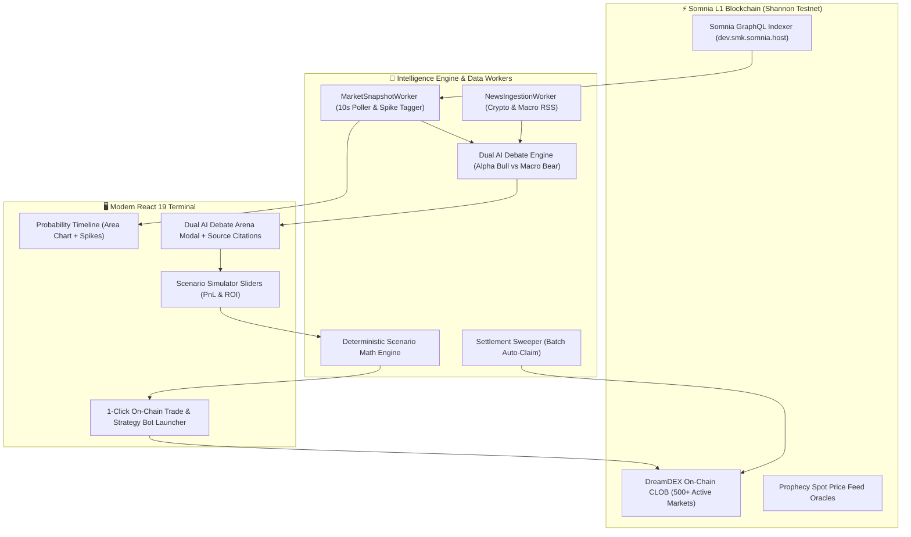

# 🧠 ForeSight — Autonomous AI Prediction Market Terminal
### *Predictive Multi-Agent Intelligence & Deterministic Simulation for DreamDEX Event Contracts on Somnia L1*

[-7C3AED?style=for-the-badge&logo=blockchain)](https://somnia.network)
[](https://dev.smk.somnia.host)
[](https://react.dev)
[](https://www.typescriptlang.org/)
[](LICENSE)

> **Project Name:** ForeSight  
> **Hackathon:** Somnia × DreamDEX Event Contracts Hackathon (DoraHacks)  
> **Core Philosophy:** *"Understand the market before you trade it"*

---

## 🌟 1. Executive Summary

In high-speed binary prediction markets (1m, 5m, 15m, and 1h BTC/ETH rounds), market odds fluctuate rapidly with sudden **probability spikes ($>10\%$)**. Retail traders and DeFi users are left in the dark: *Why did odds suddenly jump from 30% to 70%? What is the expected return if I enter now?*

**ForeSight** is the first cognitive AI trading terminal purpose-built for **DreamDEX Event Contracts on Somnia**. It replaces opaque black-box bots with an intuitive **4-step user journey**:

```
┌─────────────────────────┐     ┌─────────────────────────┐     ┌─────────────────────────┐     ┌─────────────────────────┐
│   1. WHAT HAPPENED?     │ ──> │    2. WHAT CHANGED?     │ ──> │     3. WHAT IF?         │ ──> │   4. WHAT DO I DO?      │
│   Probability Timeline  │     │   Dual AI Arena (RAG)   │     │   Scenario Simulator    │     │   1-Click CLOB Trade    │
│  (Area Chart + Spikes)  │     │  (Bull vs Bear Debate)  │     │  (Deterministic Math)   │     │  & Auto-TakeProfit Bot  │
└─────────────────────────┘     └─────────────────────────┘     └─────────────────────────┘     └─────────────────────────┘
```

---

## 🏗️ 2. System Architecture



---

## ✨ 3. Core Feature Walkthrough

### 📈 Step 1: Probability Timeline (*"What Happened?"*)
* **Area Chart Odds History:** Clean visualization of binary odds ($0\% \rightarrow 100\%$) across multiple time ranges (`15m`, `1h`, `4h`).
* **Pulsing Spike Markers:** Automatically identifies sudden volatility surges ($\ge 10\%$) and marks them directly on the chart for inspection.

### 🐂 🐻 Step 2: Dual AI Agent Debate Arena (*"What Changed?"*)
* **Alpha Bull AI:** Analyzes orderbook skew, volume inflow, and upside momentum.
* **Macro Bear AI:** Identifies overhead resistance, time decay risks, and contrarian hedging.
* **RAG Evidence Citations:** Every argument is backed by **`[View Sources]` pills** linking to live crypto headlines and macro updates.

### 🎛️ Step 3: Deterministic Scenario Simulator (*"What If?"*)
* **Zero-Latency Interactive Sliders:** Adjust Capital Allocation ($), Entry Odds, and Target Take-Profit Odds.
* **Instant Mathematical Modeling:** Calculates exact Early Exit PnL, Expected ROI %, Expiry Settlement Payoff, and Breakeven Price.

### ⚡ Step 4: 1-Click Execution & Automation (*"What Do I Do?"*)
* **1-Click CLOB Order:** Direct on-chain limit order submission to Somnia testnet via `@somnia-chain/markets-sdk`.
* **Deploy as Automated Bot:** Converts the modeled scenario into an active bot running take-profit and stop-loss rules.
* **Auto-Claim Settlement Sweeper:** One-tap batch redemption of all settled contracts.

---

## 🛠️ 4. Quickstart Guide (Localhost)

### 1. Clone & Install
```bash
git clone https://github.com/your-username/somnia-dreamdex-copilot.git
cd somnia-dreamdex-copilot
npm install
```

### 2. Configure Environment
```bash
cp .env.example .env
```
*(Optional: add `PRIVATE_KEY` for live on-chain trading; without it, the terminal operates in high-fidelity simulation mode).*

### 3. Run Backend Server (Port 3001)
```bash
npm run server
```

### 4. Run Frontend Terminal (Port 3000)
```bash
npm run ui
```
Open **`http://localhost:3000`** in your browser.

---

## 💻 5. Developer CLI Diagnostics

| Command | Action |
| :--- | :--- |
| `npm run doctor` | Validates Somnia RPC, Indexer, Venue ID, and account status |
| `npm run markets` | Scans and lists all live 500+ Event Contracts on Somnia testnet |
| `npm run claim` | Executes settlement sweep across finalized rounds |
| `npm run build` | Compiles TypeScript backend engine (`tsc`) |
| `npm run build:ui` | Builds the optimized Vite React production bundle |

---

## 📚 6. Hackathon Documentation & Deliverables

* 📖 **[Developer Feedback Report for Somnia & DreamDEX](DreamDEX-SDK-Feedback.md)**: Detailed feedback on SDK ergonomics, indexer subscriptions, and protocol improvements.
* 🎬 **[Demo Video Script (2.5 Minutes)](Demo-Video-Script.md)**: Precise narrative, timed scenes, and voiceover script for judging submission.
* 📋 **[Master Plan & Sprint Tracking](Plan-Tracking-v1.md)**: Detailed phase-by-phase execution tracking.

---

## 📄 License
MIT License. Built for the Somnia × DreamDEX Event Contracts Hackathon.
