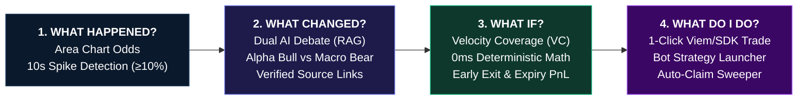

<div align="center">

# 🧠 ForeSight — Autonomous AI Prediction Market Terminal
### *Cognitive Multi-Agent Intelligence, Deterministic Trajectory Modeling & Automated Execution for DreamDEX Event Contracts on Somnia L1*

[-7C3AED?style=for-the-badge&logo=blockchain)](https://somnia.network)
[](https://dev.smk.somnia.host)
[](https://react.dev)
[](https://www.typescriptlang.org/)
[](LICENSE)

<br/>

**Live Production Terminal:** [fore-sight-tawny.vercel.app](https://fore-sight-tawny.vercel.app/) &nbsp;•&nbsp; **Somnia Shannon Testnet:** `Chain ID: 50312` &nbsp;•&nbsp; **Target Protocol:** `DreamDEX On-Chain CLOB`

<br/>

> **Core Philosophy:** *"Understand the market before you trade it"*  
> ForeSight bridges the critical gap between raw, rapid on-chain CLOB order books and human decision-making. Instead of opaque "black-box" bots, ForeSight equips traders with real-time volatility spike detection, adversarial Dual-AI news RAG debate, deterministic trajectory velocity math ($VC$), 0ms scenario stress-testing, and 1-click execution with automated batch settlement sweeps.

</div>

---

### 🧭 Judges & Developers Quick Navigation

| Resource | Description | Direct Link |
| :--- | :--- | :--- |
| 🚀 **Live Terminal UI** | Production Cyberpunk Trading Terminal on Vercel | [fore-sight-tawny.vercel.app](https://fore-sight-tawny.vercel.app/) |
| 📖 **Technical Architecture Document** | In-depth product specification, risk modeling & roadmaps | [Project-Details.md](Project-Details.md) |
| 🛠️ **DreamDEX SDK & Protocol Feedback** | 12 critical findings & ergonomic feedback for Somnia Core Devs | [DreamDEX-SDK-Feedback.md](DreamDEX-SDK-Feedback.md) |
| 🎬 **Demo Video Walkthrough** | 2.5-minute structured demonstration script & recording guide | [Demo-Video-Script.md](Demo-Video-Script.md) |
| 📋 **Sprint Tracking & Verification** | Phase-by-phase development backlog & milestone checklist | [Plan-Tracking-v1.md](Plan-Tracking-v1.md) |

---

## 🌟 1. Executive Summary & The Problem

On high-throughput, sub-second finality blockchains like **Somnia Layer 1 (100k+ TPS)**, binary prediction markets (1m, 5m, 15m, 1h BTC/ETH event contracts) operate at lightning speed. With over **500+ active markets** on DreamDEX, retail traders face three severe bottlenecks:

1. **Contextless Volatility Surges (Spikes $\ge 10\%$):** Binary odds suddenly jump from 30% to 75% in seconds. Traders have zero context on whether the surge is driven by macro news, spot momentum, or temporary order book skew.
2. **The "Black-Box AI" Dilemma (Hallucinations vs Blind Execution):** Generic LLM trading bots make unfounded predictions without citations, risking instant liquidation.
3. **Complex Non-Linear Payoffs & Stranded Capital:** Binary shares settle discontinuously ($1.00 or $0.00). Calculating early-exit ROI, required price velocity, and breakeven odds is cognitively taxing, while winnings remain stranded across hundreds of expired rounds without automatic batch sweeps.

---

## 🔄 2. The 4-Step Cognitive Trading Loop

ForeSight transforms complex, noisy event contract order books into a structured, rational **4-step user journey**:

```
┌─────────────────────────┐     ┌─────────────────────────┐     ┌─────────────────────────┐     ┌─────────────────────────┐
│   1. WHAT HAPPENED?     │ ──> │    2. WHAT CHANGED?     │ ──> │     3. WHAT IF?         │ ──> │   4. WHAT DO I DO?      │
│   Probability Timeline  │     │   Dual AI Arena (RAG)   │     │   Trajectory Simulator  │     │   1-Click CLOB Trade    │
│  (Area Chart + Spikes)  │     │  (Bull vs Bear Debate)  │     │  (Deterministic Math)   │     │  & Auto-Claim Sweeper   │
└─────────────────────────┘     └─────────────────────────┘     └─────────────────────────┘     └─────────────────────────┘
```



### 📈 Step 1: Probability Timeline (*"What Happened?"*)
* **Real-Time Interactive Area Charts:** Visualizes continuous implied odds ($0\% \rightarrow 100\%$) across multiple time windows (`15m`, `1h`, `4h`).
* **Automated Spike Detection Worker:** Continuously polls the DreamDEX GraphQL Indexer every 10 seconds. Any volatility surge $\ge 10\%$ between snapshots is automatically tagged with a pulsing spike marker and timestamp.

### 🐂 🐻 Step 2: Dual AI Debate Arena (*"What Changed?"*)
* **Adversarial Multi-Agent Debate:** When inspecting a price spike, the engine triggers two opposing AI perspectives:
  * **Alpha Bull AI:** Analyzes orderbook bid depth, upside momentum, and positive spot drift.
  * **Macro Bear AI:** Evaluates overhead resistance, time decay ($Theta$), and contrarian downside risks.
* **Anti-Hallucination RAG Citations:** Every argument is backed by verified `[View Sources]` links retrieved from real-time crypto & financial RSS streams (CoinDesk, Cointelegraph, Binance News).

### 🎛️ Step 3: Trajectory Modeling & Deterministic Math (*"What If?"*)
* **Velocity Coverage Metric ($VC$):** Converts speculative betting into measurable physical trajectory math:
  $$\Delta\%_{\text{required}} = \frac{|P_{\text{strike}} - P_{\text{current}}|}{P_{\text{current}}} \times 100\%$$
  $$v_{\text{req}} = \frac{\Delta\%_{\text{required}}}{T_{\text{remaining}}} \quad (\%/\text{minute})$$
  $$VC = \frac{v_{\text{obs}}}{v_{\text{req}}} \quad \text{(e.g., } 1.35\times \text{ required velocity)}$$
* **0ms Client-Side Financial Simulator:** Instant sliders calculate Entry Shares, Early-Exit PnL, Expiry Payoff, and Breakeven Odds without API latency.

### ⚡ Step 4: 1-Click Execution & Settlement Sweeper (*"What Do I Do?"*)
* **1-Click CLOB Order Submission:** Dispatches limit orders directly to DreamDEX contracts via `@somnia-chain/markets-sdk` and Viem.
* **Simulation Mode Fallback:** High-fidelity in-memory trading mode for zero-risk strategy testing.
* **Auto-Claim Settlement Sweeper:** One-tap batch scanner that detects finalized rounds and automatically claims all stranded winnings.

---

## 🏗️ 3. Full-Stack System Architecture

```
┌────────────────────────────────────────────────────────────────────────────────────────┐
│                              🖥️ CLIENT / UI LAYER (React 19)                            │
│  - Cyberpunk Terminal UI        - Recharts Probability Area Chart                      │
│  - Dual AI Arena Debate Modal   - 0ms Scenario Math Sliders & Velocity Badge ($VC$)    │
│  - Web3 Connect (Viem/EIP-1193) - Auto-Claim Sweeper Batch Table                       │
└───────────────────────────────────────────┬────────────────────────────────────────────┘
                                            │ REST / WebSocket / Viem
┌───────────────────────────────────────────▼────────────────────────────────────────────┐
│                        🧠 INTELLIGENCE ENGINE & BACKGROUND WORKERS                     │
│  ┌─────────────────────────────┐ ┌─────────────────────────────┐ ┌───────────────────┐ │
│  │    MarketSnapshotWorker     │ │     NewsIngestionWorker     │ │  DualDebateEngine │ │
│  │ (10s Poller & Spike Tagger) │ │  (RSS Feed Ingestion & RAG) │ │ (Bull vs Bear AI) │ │
│  └─────────────────────────────┘ └─────────────────────────────┘ └───────────────────┘ │
│  ┌─────────────────────────────┐ ┌─────────────────────────────┐ ┌───────────────────┐ │
│  │   Deterministic Math Core   │ │   Settlement Sweeper Worker │ │ Supabase Postgres │ │
│  │ (Velocity $VC$, PnL & ROI)  │ │ (Batch Auto-Claim Finalized)│ │  (History & Cache)│ │
│  └─────────────────────────────┘ └─────────────────────────────┘ └───────────────────┘ │
└───────────────────────────────────────────┬────────────────────────────────────────────┘
                                            │ GraphQL / JSON-RPC / SDK
┌───────────────────────────────────────────▼────────────────────────────────────────────┐
│                       ⚡ SOMNIA L1 BLOCKCHAIN & PROTOCOL LAYER                          │
│  - DreamDEX On-Chain CLOB (BinaryPool & BinaryMarket Contracts)                        │
│  - Somnia GraphQL Indexer (https://dev.smk.somnia.host/v1/graphql)                     │
│  - Prophecy Decentralized Spot Price Feed Oracles (BTC/USD, ETH/USD)                   │
│  - Somnia Shannon Testnet (Chain ID: 50312, Sub-Second Blocks)                          │
└────────────────────────────────────────────────────────────────────────────────────────┘
```

---

## 📐 4. Mathematical Modeling & Settlement Formulations

ForeSight strictly separates subjective news analysis from **deterministic financial mathematics**:

### 1. Velocity Coverage ($VC$) Formulation
To determine whether an event contract has sufficient spot momentum to hit its strike price prior to expiry:
* **Distance to Strike:** $\Delta P = |P_{\text{strike}} - P_{\text{current}}|$
* **Required Velocity:** $v_{\text{req}} = \frac{\Delta P / P_{\text{current}}}{T_{\text{remaining}}}$
* **Observed Price Velocity:** $v_{\text{obs}} = \frac{P_{\text{current}} - P_{t-15\text{m}}}{15}$
* **Trajectory Coverage Ratio:**
  $$VC = \frac{v_{\text{obs}}}{v_{\text{req}}}$$
  * If $VC \ge 1.0\times$: Observed momentum is mathematically sufficient to cross strike at current velocity.
  * If $VC < 1.0\times$: Market requires an acceleration event to resolve $YES$.

### 2. Discrete Binary Payoff & PnL Formulation
Given user allocation $C$ (Collateral) and entry odds $P_{\text{entry}} \in [0.01, 0.99]$:
* **Contracts Minted:** $N = \frac{C}{P_{\text{entry}}}$
* **Early-Exit PnL (at target odds $P_{\text{target}}$):**
  $$\text{PnL}_{\text{early}} = (N \times P_{\text{target}}) - C = C \times \left( \frac{P_{\text{target}} - P_{\text{entry}}}{P_{\text{entry}}} \right)$$
* **Expiry Settlement PnL (at settlement price $\$1.00$):**
  $$\text{PnL}_{\text{expiry}} = (N \times \$1.00) - C = C \times \left( \frac{1.00 - P_{\text{entry}}}{P_{\text{entry}}} \right)$$
* **Maximum Risk:** $\text{Max Loss} = -100\% \times C$

---

## 🤖 5. Automated Trading Bot Suite

ForeSight includes ready-to-run strategy bots powered by `@somnia-chain/markets-sdk`:

| Strategy CLI | Description | Execution Logic |
| :--- | :--- | :--- |
| `npm run agent:starter` | **Starter Order Bot** | Submits baseline limit orders and validates wallet approvals |
| `npm run agent:maker` | **Two-Sided Market Maker** | Quotes dynamic bid-ask spreads around mid-market probability |
| `npm run agent:oracle` | **Oracle Momentum Follower** | Evaluates Prophecy spot oracle drift and takes mispriced orders |
| `npm run agent:copilot` | **Autonomous AI Copilot** | Executes conditional orders based on Dual AI conviction scores |

---

## 💻 6. Developer Diagnostics & CLI Toolkit

ForeSight ships with a comprehensive suite of developer diagnostics for Somnia network validation:

```bash
# 1. Validate Somnia RPC, Indexer, Venue ID, and account status
npm run doctor

# 2. Query and list all 500+ active event contracts on Somnia Shannon
npm run markets

# 3. Scan finalized markets and execute automated batch settlement sweep
npm run claim

# 4. Compile backend TypeScript engine
npm run build

# 5. Build production-optimized React 19 / Vite bundle
npm run build:ui
```

---

## ⚡ 7. Quickstart Guide (Local Setup in 3 Minutes)

### Prerequisites
* Node.js $\ge 20.0.0$
* npm or pnpm

### 1. Clone & Install
```bash
git clone https://github.com/DanhCaTuanNgoc/ForeSight.git
cd ForeSight
npm install
```

### 2. Configure Environment
```bash
cp .env.example .env
```
*(Optional: Add `PRIVATE_KEY` for live on-chain testnet execution; without it, ForeSight runs in high-fidelity simulation mode).*

### 3. Launch Backend Services & Workers (Port 3001)
```bash
npm run server
```

### 4. Launch Frontend Terminal (Port 3000)
```bash
npm run ui
```
Open **`http://localhost:3000`** to access the live ForeSight terminal.

---

## 📊 8. Hackathon Landscape & Competitive Differentiation

| Feature / Dimension | 🧠 **ForeSight** | 🪞 **rampart** | ⚡ **DreamPulse** | 🗡️ **Market Dungeon** |
| :--- | :---: | :---: | :---: | :---: |
| **Product Category** | **Decision Terminal** | Protocol Mechanism | Quant Auto-Swarm | Roguelite Game |
| **Target User** | **Retail & DeFi Traders** | Market Makers | Automated Traders | Web3 Gamers |
| **Cognitive Framework** | **4-Step Explainable Loop** | Bytecode Verification | Black-box Bot | Gamified Settlement |
| **RAG News Citations** | **Yes (Dual Bull vs Bear)** | No | No | No |
| **Deterministic Math** | **$VC$ Velocity Coverage** | Opcode Disassembler | $\Phi(z)$ Black-Scholes | Game Combat Math |
| **Auto-Claim Sweeper** | **Integrated 1-Click** | Manual Sweep | Auto-Compounder | Read-Only |
| **On-Chain Execution** | **Live CLOB + Simulation** | Revert Proof Only | Live CLOB Swarm | Read-Only |

---

## 📄 License

MIT License. Built with ❤️ for the **Somnia × DreamDEX Event Contracts Hackathon** on DoraHacks.
